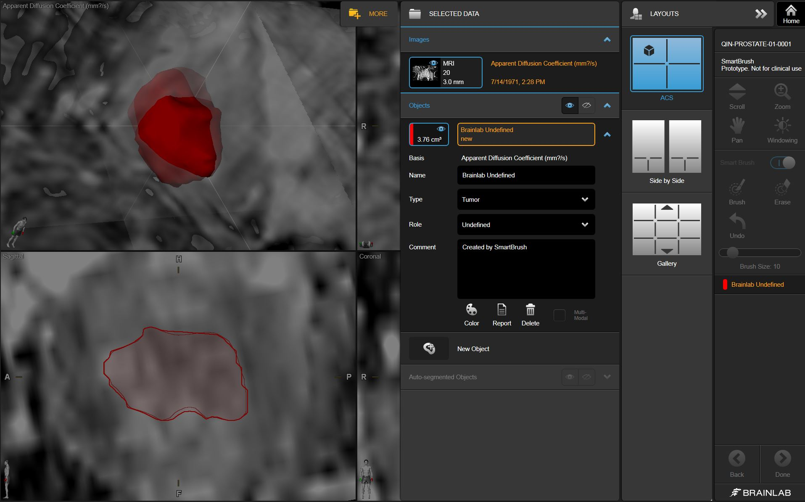

  1.**Description of the platform/product**:

  * **name and version of the software**: Brainlab SmartBrush 2.5 and Brainlab SmartViewer 3.1; SmartViewer can only display DICOM SEG; SmartBrush can create SEG and display them, however SmartViewer displays them much better
  * **free?** no
  * **commercial?** yes
  * **open source?** no
  * **what DICOM library do you use?** [Merge DICOM Toolkit](http://www.merge.com/Solutions/Toolkits/Merge-DICOM-Toolkit.aspx), however the toolkit does not provide API for handling DICOM SEG objects, so all of the features related to handling DICOM SEG had to be implemented

  2.**Description of the relevant features of the platform**:

  * **are both single and multiple segments supported?** Current version of Brainlab SmartBrush can write only single-segment objects, but reads both single- and multi-segment
  * **how are the overlapping segments handled?** The user can see the outline of the contour \(the area inside the the contour is slightly color-washed\)
  * **do you support both BINARY and FRACTIONAL segmentation types?** Brainlab always exports segmentations as FRACTIONAL type and RLE-compressed
  * **do you render the segment using the color specified in the DICOM object?** yes
  * **how do you communicate segment semantics to the user?** The type of the segment property which is stored inside Segmented Property Type Code Sequence is displayed to the user.
  * **how do you support the user in defining the semantics of the object at the time segmentation is created?** The type of the segment \(i.e.Tumor, Implant, Bone and Undefined\) can be selected by the user when creating a Segmentation object.

  **Demonstration video on YouTube** \(recorded at RSNA 2015 DICOM4QI\): [https://youtu.be/2J3sxpqHtlY](https://youtu.be/2J3sxpqHtlY).

  3.**Read task**: load each of the DICOM SEG datasets that accompany the imaging series into your platform

  **Test dataset \#1**

  | Test dataset | Result of rendering |
  | -- | -- |
  | 3D Slicer |  |

  **Test dataset \#2**

  | Test dataset | Result of rendering |
  | -- | -- |
  | Brainlab |  |

  **Test dataset \#3**

  | Test dataset | Result of rendering |
  | -- | -- |
  | 3D Slicer |  |

  **Test dataset \#4**

  | Test dataset | Result of rendering |
  | -- | -- |
  | 3D Slicer |  |

  4.**Write task**

  `dciodvfy` checks produce no errors:

```text
(0x0069,0x1001)  ?  - Warning - Unrecognized tag - assuming explicit value representation OK
Warning - Missing attribute or value that would be needed to build DICOMDIR - Study ID
Segmentation
Warning - Unrecognized defined term <99BL-GEN> for value 1 of attribute <Coding Scheme Designator>
```

  | Output dataset | Result of rendering in Brainlab|
  | -- | -- |
  | [#3 write result](http://slicer.kitware.com/midas3/download/item/266127/SEG_BL_DataSet3_compressed.dcm) |   |
  | [#4 write result](http://slicer.kitware.com/midas3/download/item/266126/SEG_BL_DataSet4_compressed.dcm) |    |
