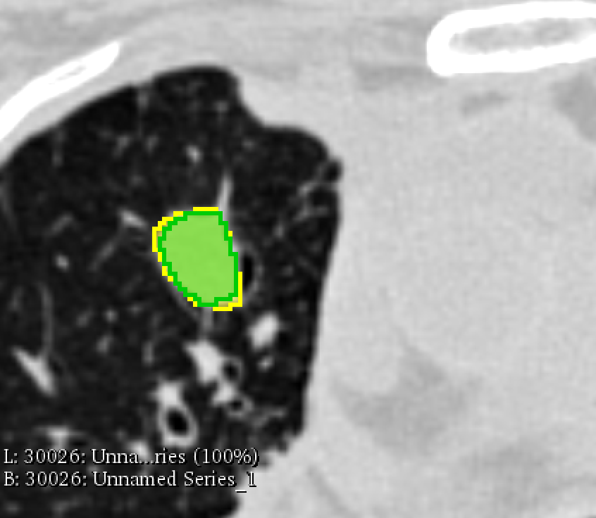
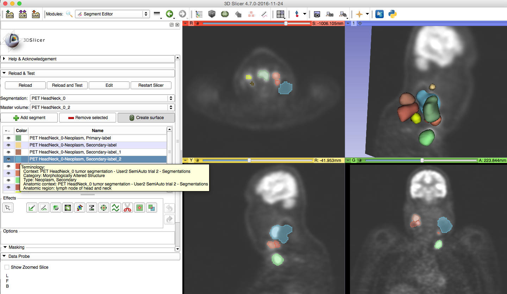

| Tool name | Description of the platform| Read task | Write task |
| -- | -- | -- | -- |
| [3D Slicer](/results/seg/slicer.md) |  |  |  |
| [Brainlab](/results/seg/brainlab.md) |  |  |  |
| [ePAD](/results/seg/epad.md) |  |  |  |
| [AIM on ClearCanvas](/results/seg/aimclearcanvas.md) ** * **|  |  |  |
| [MeVisLab](/results/seg/MeVisLab.md) |  |  |  |
| [AMI](/results/seg/ami.md) |  |  |  |
| [MITK](/results/seg/MITK.md) |  |  |  |
| [Mint Medical](/results/seg/mint.md) |  |  |  |
| XNAT |  |  |  |
| Koelis |  |  |  |
| [Pixelmed DicomImageViewer](/results/seg/pixelmed.md) |  |  |  |
| [Siemens syngo.via](/results/seg/syngovia.md) ** * **|  |  |  |
| OsiriX Lite ** * **|  |  |  |
| [FreeSurfer](/results/seg/freesurfer.md) |  | N/A |  (see notes)|

 **\* DISCLAIMER: Platforms marked with the asterisk were tested without involvement of the platform developers or supporting team.**

**Legend**

*  - waiting for response

*  - task completed

*  - no response received, or for some reason task could not be completed

## 3D Slicer

1.**Description of the platform/product**:

* **name and version of the software**: 3D Slicer, Nightly release 4.7.0-2016-11-24, with Reporting extension installed
* **free?** yes [http://download.slicer.org](http://download.slicer.org)
* **commercial?** no
* **open source?** yes [http://github.com/slicer/slicer](http://github.com/slicer/slicer)
* **what DICOM library do you use?** [DCMTK](http://dcmtk.org), [DCMQI](http://github.com/qiicr/dcmqi)

2.**Description of the relevant features of the platform**:

* **are both single and multiple segments supported?** yes **how are the overlapping segments handled?** solid color of the outline is shown for all segments; inner area is shown semi-transparent \(see screenshot below showing both AIMonClearCanvas and Brainlab datasets from the Read task\)

* **do you support both BINARY and FRACTIONAL segmentation types?** only BINARY can be displayed; SEGs that are saved as FRACTIONAL will be read as BINARY \(i.e., no mapping to fractional occupancy or probability will be done\)
* **do you render the segment using the color specified in the DICOM object?** yes
* **how do you communicate segment semantics to the user?** Display of the segment semantics is provided in specialized Slicer modules. As of November 2016, semantics is shown in a tooltip over the color swatch in the list of segments in Segment Editor module \(see screenshot below\). Similar interface is provided in the Reporting module.

* **how do you support the user in defining the semantics of the object at the time segmentation is created?** user can select from the terminology lists by double-clicking on the colored square while editing segment, see screenshot below. Color can also be specified. Certain combinations of codes have suggested colors.

3.**Read task**: load each of the DICOM SEG datasets that accompany the imaging series into your platform

**Test dataset \#1**

| Test dataset | Result of rendering |
| :--- | :--- |
| 3D Slicer |   |
| syngo.via |   |
| AIMonClearCanvas |   |

Note: Brainlab dataset could not be loaded, since it does not have SliceThickness attribute \(see CP-1426\). This issue has been since fixed in Brainlab, but test datasets 1 and 2 have not been updated.

**Test dataset \#2**

| Test dataset | Result of rendering |
| :--- | :--- |
| 3D Slicer |   |

**Test dataset \#3**

| Test dataset | Result of rendering |
| :--- | :--- |
| 3D Slicer |   |

**Test dataset \#4**

| Test dataset | Result of rendering |
| :--- | :--- |
| 3D Slicer |   |

4.**Write task**

* segment the lung lesion using any method available in your platform; save the result as DICOM SEG; please include in the series description the name of your tool to simplify comparison tasks!
  * results are uploaded
* run [dciodvfy DICOM validator](http://www.dclunie.com/dicom3tools/dciodvfy.html); iterate on resolving the identified issues as necessary
  * no errors, only warnings from dciodvfy
