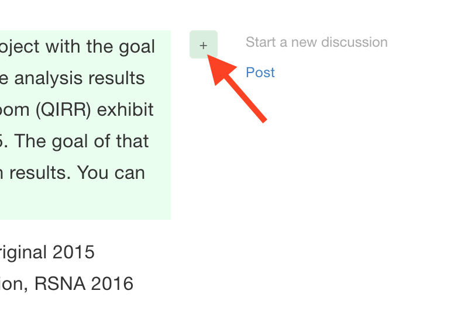

# Contributing to this document

There are several ways you can contribute.

## Contributing the content

You can either follow the instructions for the specific type of object, and submit your responses/screenshots/datasets by email/Dropbox, or you can edit this document directly.

If you want to edit the section for your platform yourself, follow the instructions below:

1. Create an account on [GitBook](https://www.gitbook.com/) \(you can reuse your GitHub login to authenticate\)
2. Send your login name to Andrey Fedorov, so that he can add you to the list of collaborators. 
3. Take a look at [this video ](https://www.youtube.com/watch?v=-DkV2ainp10)to get started with the editing process.

## Comments/discussion

You can initiate a discussion for a specific paragraph of text. If you mouse over the paragraph while reading [the web version of the book](https://fedorov.gitbooks.io/rsna2016-qirr-dicom4qi) on gitbooks.io, you should see a **"+"** to the right of the paragraph you are reading. You can click it and initiate a new discussion, as shown in the screenshot below.

Note that you will need to sign in before you can participate in a discussion \(gitbook accepts Facebook, Twitter, Google and Github authentication\).

