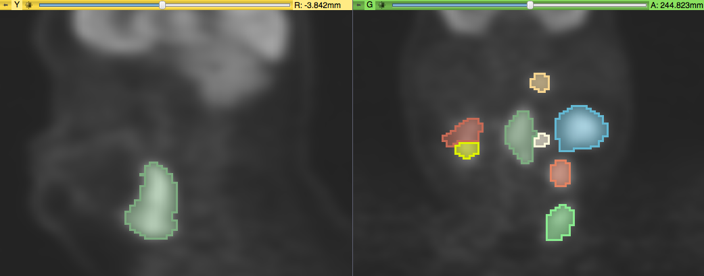

# Segmentations (DICOM SEG)

Tasks for participants:

1. **Description of the platform/product**:
 * **name and version of the software** used for testing
 * **free?** if yes - include the download link
 * **commercial?** if yes - include the home page for the product
 * **open source?** if yes - provide a link to source code
 * **what DICOM library do you use?** - if you use certain DICOM toolkit to support this functionality, please list it, if possible

 * **Description of the relevant features of the platform**: 
    * are both single and multiple segments supported? how are the overlapping segments handled? 
    * do you support both BINARY and FRACTIONAL segmentation types? 
    * do you support compressed objects?
    * do you render the segment using the color specified in the DICOM object? 
    * how do you communicate segment semantics to the user? 
    * how do you support the user in defining the semantics of the object at the time segmentation is created?

3. **Read task** (for each dataset!)
 * load each of the DICOM SEG datasets that accompany the imaging series into your platform
 * submit a screenshot demonstrating the overlay of the segmentation on the CT series, and any other components of the user interface (e.g., presentation of the ROI semantics to the user, communication of the algorithm metadata) by email to Andrey Fedorov

4. **Write tasks**
 * **Single segment**: segment any area (ideally, the lung lesion in the Test dataset #1) using any method available in your platform
 *  **Multiple segments**: segment any two areas in any of the datasets using any method available in your platform (ideally, such that ther is a single slice where both segments are visible). Make sure to create separate segment for each of the segmented areas!
 * save the result as DICOM SEG; if possible, please include in the series description the name of your tool to simplify comparison tasks!
 * run [dciodvfy DICOM validator](http://www.dclunie.com/dicom3tools/dciodvfy.html); iterate on resolving the identified issues as necessary
 * send the resulting objects and the result of **dciodvfy**, explaining any discrepancies found, to Andrey Fedorov by email
 
Note: (1) we are not assessing the accuracy of lesion segmentation, any method is  good; (2) the screenshots and the DICOM SEG objects you submit will be distributed publicly and included in this document in the Results section.

### Test dataset #1

The imaging dataset is a chest CT with a single lung lesion located in the right lung lobe. This dataset is subject LIDC-IDRI-0314 from The Cancer Imaging Archive ([TCIA](http://www.cancerimagingarchive.net/)) [LIDC-IDRI](https://wiki.cancerimagingarchive.net/display/Public/LIDC-IDRI) collection.

**Image dataset**

Download the zip archive of the CT series [here](http://slicer.kitware.com/midas3/download/item/245513/LIDC-IDRI-0314-CT.zip). The location of the lesion is highlighted below (visualized in 3D Slicer software).

**Segmentation datasets**

Download the DICOM SEG datasets produced by the platforms that already submitted results [here](http://slicer.kitware.com/midas3/folder/3774) (data is organized in subfolders corresponding to the individual platforms).

### Test dataset #2

The imaging dataset consists of a PET and CT series for subject QIN-HEADNECK-01-0024 from the TCIA [QIN-HEADNECK](https://wiki.cancerimagingarchive.net/display/Public/QIN-HEADNECK) collection. This data set contains two lesions. This allows to test that the platform can handle more than one segment.

**Image dataset**

Download the zip archive of the CT series [here](http://slicer.kitware.com/midas3/download/item/245508/QIN-HEADNECK-01-0024-CT.zip), and PET series [here](http://slicer.kitware.com/midas3/download/item/245509/QIN-HEADNECK-01-0024-PET.zip). Lesions are more prominent on the PET series, as shown in the screenshot below (visualized in 3D Slicer software).

**Segmentation datasets**

Download the DICOM SEG datasets produced by the platforms that already submitted results [here](http://slicer.kitware.com/midas3/folder/3786) (data is organized in subfolders corresponding to the individual platforms).

### Test dataset #3

The imaging dataset consists of a PET and CT series for subject QIN-HEADNECK-01-0139 from the TCIA [QIN-HEADNECK](https://wiki.cancerimagingarchive.net/display/Public/QIN-HEADNECK) collection. This data set contains 11 lesions. This allows to test that the platform can handle relatively large number of segments.

**Image dataset**

Download the zip archive of the CT series [here](http://slicer.kitware.com/midas3/download/item/257233/QIN-HEADNECK-01-0139-CT.zip), and PET series [here](http://slicer.kitware.com/midas3/download/item/257234/QIN-HEADNECK-01-0139-PET.zip). Lesions are more prominent on the PET series, as shown in the screenshot below (visualized in 3D Slicer software).

**Segmentation datasets**

Download the DICOM SEG datasets produced by the platforms that already submitted results [here](http://slicer.kitware.com/midas3/folder/3858) (data is organized in subfolders corresponding to the individual platforms).