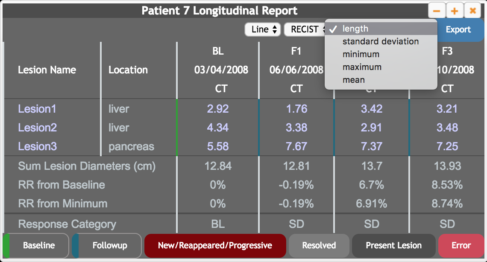
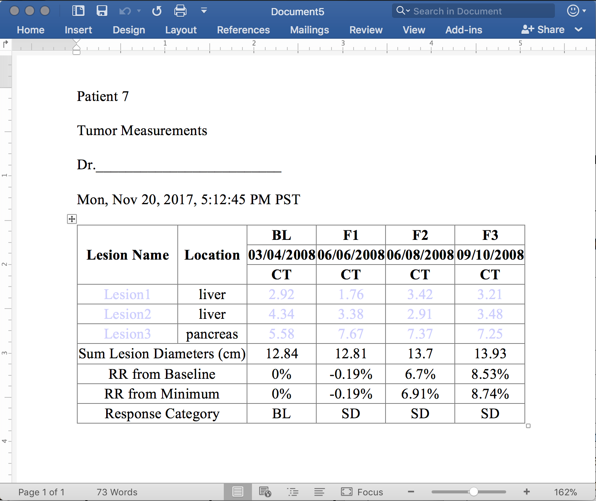
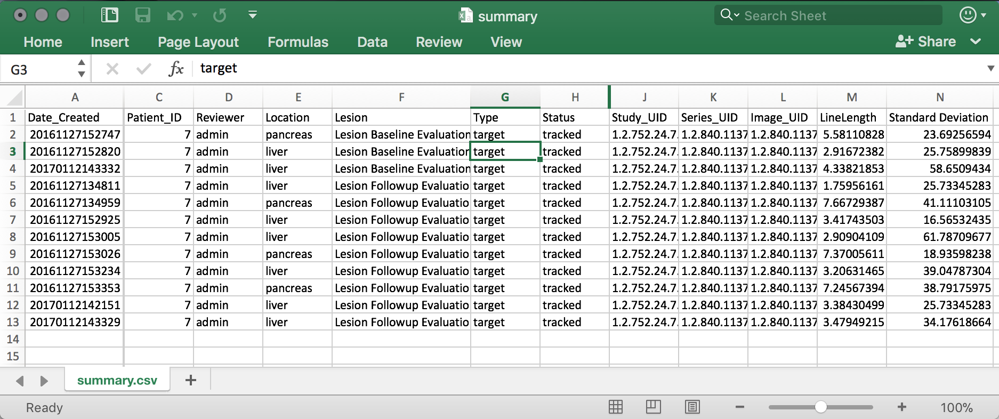
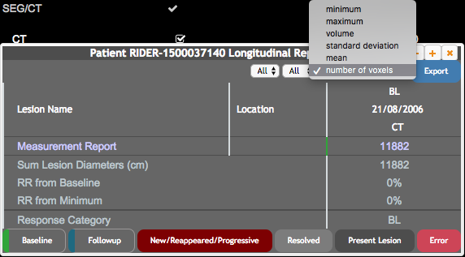
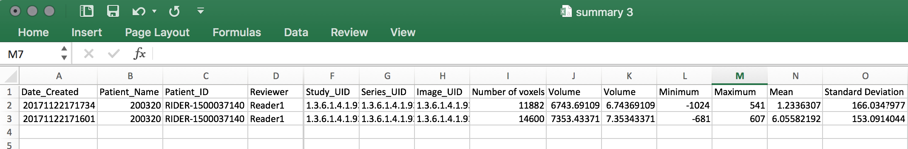

# ePAD

1. **Description of the platform/product**:
   * **name and version of the software**: ePAD, version 2.9
   * **free?** yes [https://epad.stanford.edu/epad-agreement](https://epad.stanford.edu/epad-agreement)
   * **commercial?** no
   * **open source?** yes except plugins and UI project github.com/RubinLab/
   * **what DICOM library do you use?** [PixelMed](http://www.pixelmed.com/), [DCM4CHE](http://www.dcm4che.org/)
2. **Description of the relevant features of the platform**:

   * **hanging protocol**: user can select multiple studies in the search view and open them together using the eye icon. ePAD doesn't support any other hanging protocol specifications yet.
   * **plotting**: ePAD doesn't currently support plotting the changes in the measurements.
   * **handling multiple timepoints/measurements/findings**: ePAD shows a table of the time points using a filter for the measurements. The table has a summary section which calculates the response rate and response category using the values that are seen on the table. User can view a specific annotation by clicking on the measurement value in that time point, or click on the name of the lesion to open annotations of that lesion on all time points.

   

   * **human-readable report**: ePAD supports exporting a word document of the filtered table as a report that can be filed. ePAD also supports exporting all the measurements collected from multiple annotations to be exported in excel format.

   

   

3. **Read task**\(for each dataset!\)

   * The test dataset has two studies that have the same date and don't have the study time at all. Because of this issue, ePAD treats them as duplicate studies and shows only one time point and uses measurements from only one of the annotations. Below is the screenshot of the populated longitudinal annotation report. The measurement types extracted from the DicomSR can be seen in the figure. Measurement exporting functionality works without problems and exports a spreadsheet of the measurements as illustrated below.

   

   

   * Unfortunately, there seems to be no publicly available dataset for testing the longitudinal annotations yet. The read task will be repeated when there is a proper publicly available dataset with multiple time points.

