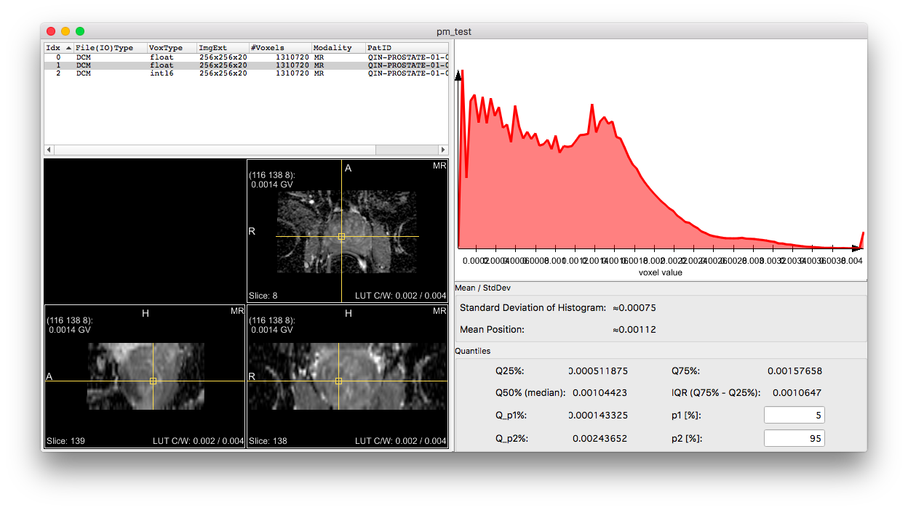

# MeVisLab

Tasks for participants:

1. **Description of the platform/product**:
 * **name and version of the software**: MeVisLab 3.0
 * **free?** yes http://www.mevislab.de/download
 * **commercial?** commercial licenses available on request
 * **open source?** no (only partially, sources included in above download)
 * **what DICOM library do you use?** custom (MLDicomTree, using some headers from dcmtk)

 * **Description of the relevant features of the platform**: 
   MeVisLab is an IDE, not an end-user application.  The screenshots below are from a custom MeVisLab network quickly put together just in order to demonstrate the PM reading for this context.  The demonstrated capability becomes available to all clinical applications and prototypes built using recent MeVisLab versions.
3. **Read task** (for each dataset!)
 * load each of the DICOM Parametric map datasets into your platform
 * submit a screenshot demonstrating the presentation of the loaded parametric maps to the user by email to Andrey Fedorov

### Test dataset #1

### Test dataset #2

