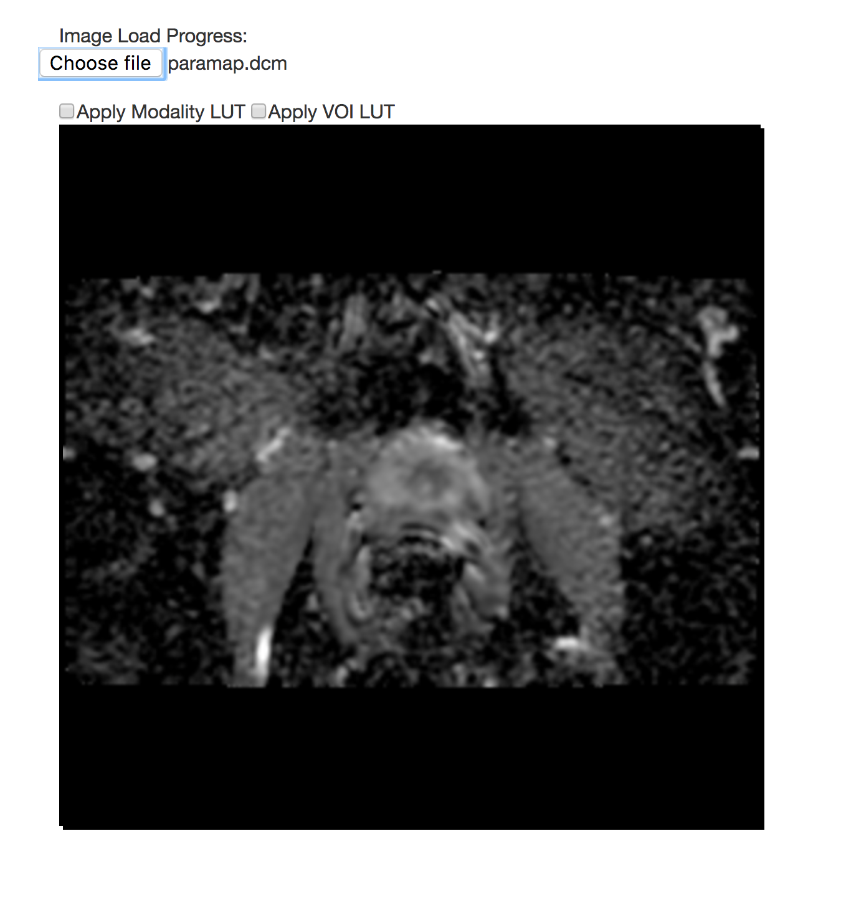
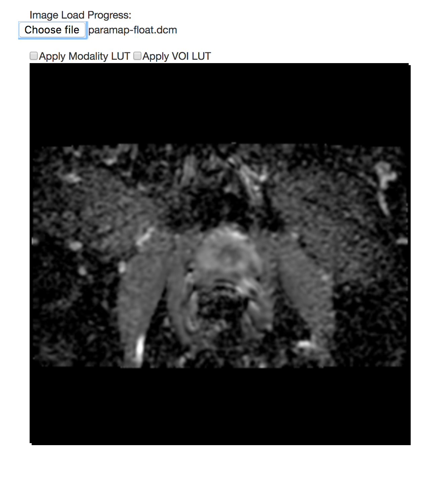

# Cornerstone

Tasks for participants:

1.**Description of the platform/product**:

* **name and version of the software**: Cornerstone \(WADO Image Loader &gt;= 1.0.4\)
* **free?** yes [https://github.com/cornerstonejs](https://github.com/cornerstonejs)
* **commercial?** no
* **open source?** yes [https://github.com/cornerstonejs](https://github.com/cornerstonejs)
* **what DICOM library do you use?** dicomParser \([https://github.com/cornerstonejs/dicomParser](https://github.com/cornerstonejs/dicomParser)\)
* **Description of the relevant features of the platform**:
  * Cornerstone is an open source project with a goal to deliver a complete web based medical imaging platform. 

1. **Read task**

This can be tested live here: [https://rawgit.com/cornerstonejs/cornerstoneWADOImageLoader/master/examples/dicomfile/index.html](https://rawgit.com/cornerstonejs/cornerstoneWADOImageLoader/master/examples/dicomfile/index.html)

Just upload your parametric maps into the live demo.

## Test dataset \#1

## Test dataset \#2

