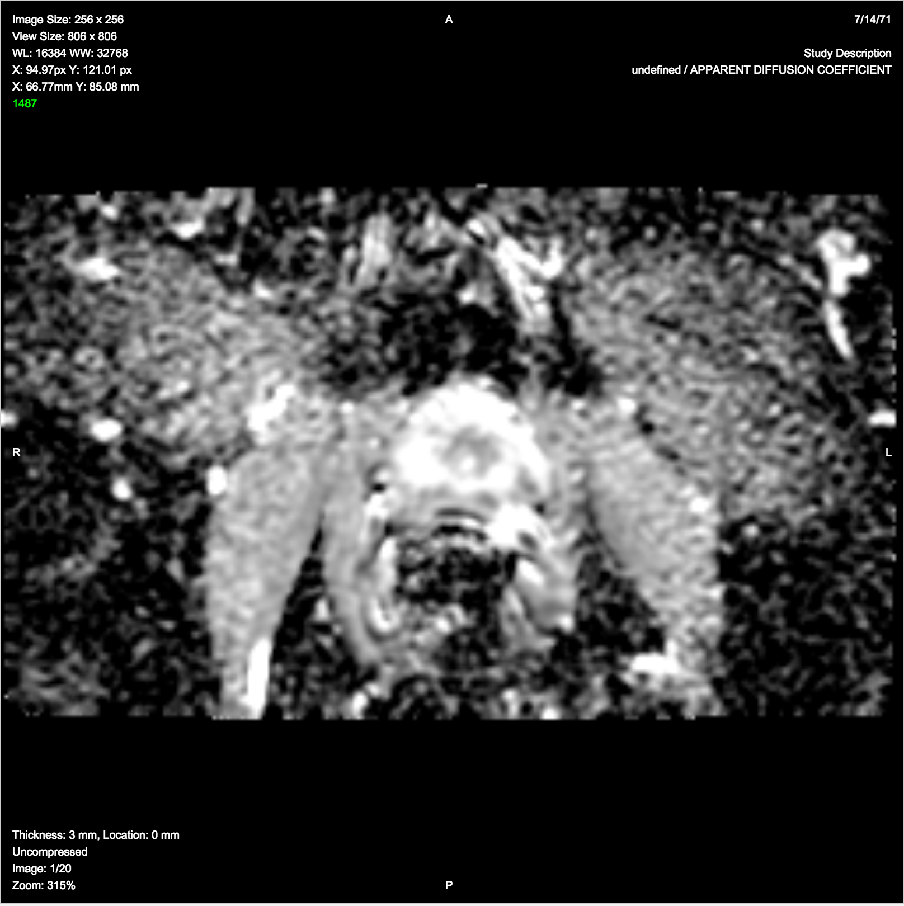

| NOTE: As of November 2018, the new home of DICOM4QI is here: https://dicom4qi.readthedocs.io|
| --- |

# ePAD

Tasks for participants:

1.**Description of the platform/product**:
 * **name and version of the software**: ePAD, version **TBD**
 * **free?** yes https://epad.stanford.edu/epad-agreement
 * **commercial?** no
 * **open source?** yes except plugins and UI project github.com/RubinLab/
 * **what DICOM library do you use?** [PixelMed](http://www.pixelmed.com/), [DCM4CHE](http://www.dcm4che.org/)

 * **Description of the relevant features of the platform**: 
    * at the moment (Nov 2016), there is no user interface or custom modules  to specify quantity or units 
    * at the moment (Nov 2016), ePAD does not have any modules that generate DICOM parametric map modality objects, only importing is supported
    
3. **Read task** (for each dataset!)

 
### Test dataset #1

### Test dataset #2

