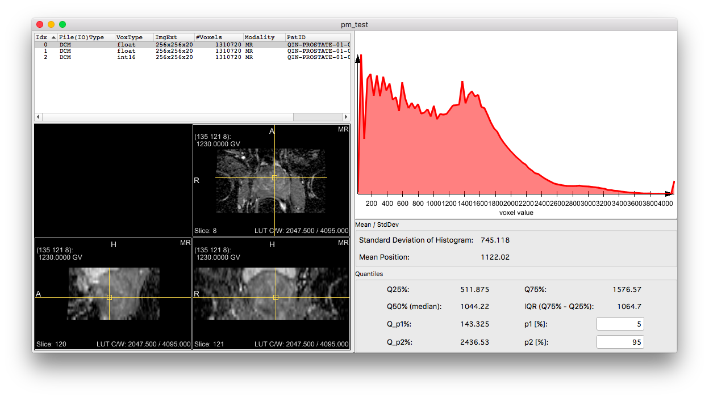

# MeVisLab

Tasks for participants:

1. **Description of the platform/product**:
   * **name and version of the software**: MeVisLab 3.0
   * **free?** yes [http://www.mevislab.de/download](http://www.mevislab.de/download)
   * **commercial?** commercial licenses available on request
   * **open source?** no \(only partially, sources included in above download\)
   * **what DICOM library do you use?** custom \(MLDicomTree, using some headers from dcmtk\)
   * **Description of the relevant features of the platform**:  MeVisLab is an IDE, not an end-user application.  The screenshots below are from a custom MeVisLab network quickly put together just in order to demonstrate the PM reading for this context \(you can find the network and the accompanying [script](https://github.com/qiicr/dicom4qi/tree/7ac34ccdf4477ff6e51ff8d5528794fcc4cfd4c9/results/pm/mevislab/pm_test.script) and [network](https://github.com/qiicr/dicom4qi/tree/7ac34ccdf4477ff6e51ff8d5528794fcc4cfd4c9/results/pm/mevislab/pm_test.mlab)\).  The demonstrated capability becomes available to all clinical applications and prototypes built using recent MeVisLab versions.
2. **Read task** \(for each dataset!\)
   * load each of the DICOM Parametric map datasets into your platform
   * submit a screenshot demonstrating the presentation of the loaded parametric maps to the user by email to Andrey Fedorov

## Test dataset \#1

## Test dataset \#2

