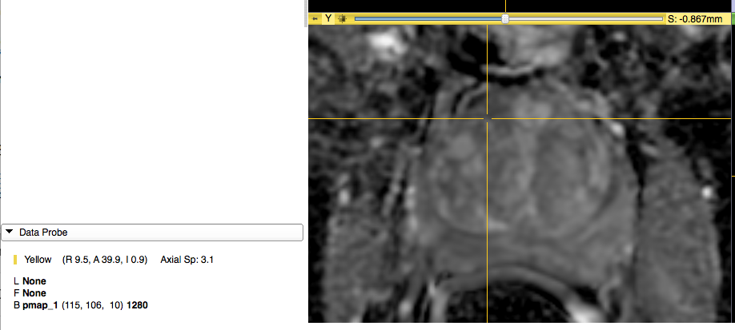

# 3D Slicer

Tasks for participants:

1.**Description of the platform/product**:
 * **name and version of the software**: 3D Slicer, Nightly release 4.5.0-2016-11-17, with Reporting Extension installed
 * **free?** yes http://download.slicer.org
 * **commercial?** no
 * **open source?** yes http://github.com/slicer/slicer
 * **what DICOM library do you use?** [DCMTK](http://dcmtk.org)

 * **Description of the relevant features of the platform**: 
    * at the moment (Nov 2016), there is no user interface or custom modules  to specify quantity or units 
    * at the moment (Nov 2016), 3D Slicer does not have any modules that generate DICOM parametric map modality objects
    
3. **Read task** (for each dataset!)
 * load each of the DICOM Parametric map datasets into your platform
 * submit a screenshot demonstrating the presentation of the loaded parametric maps to the user by email to Andrey Fedorov
 
### Test dataset #1

### Test dataset #2

