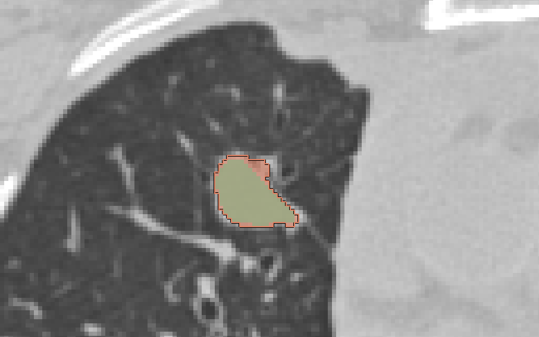
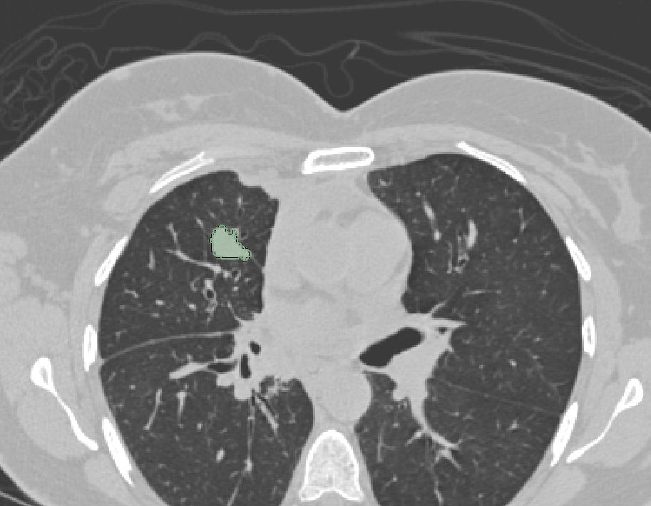
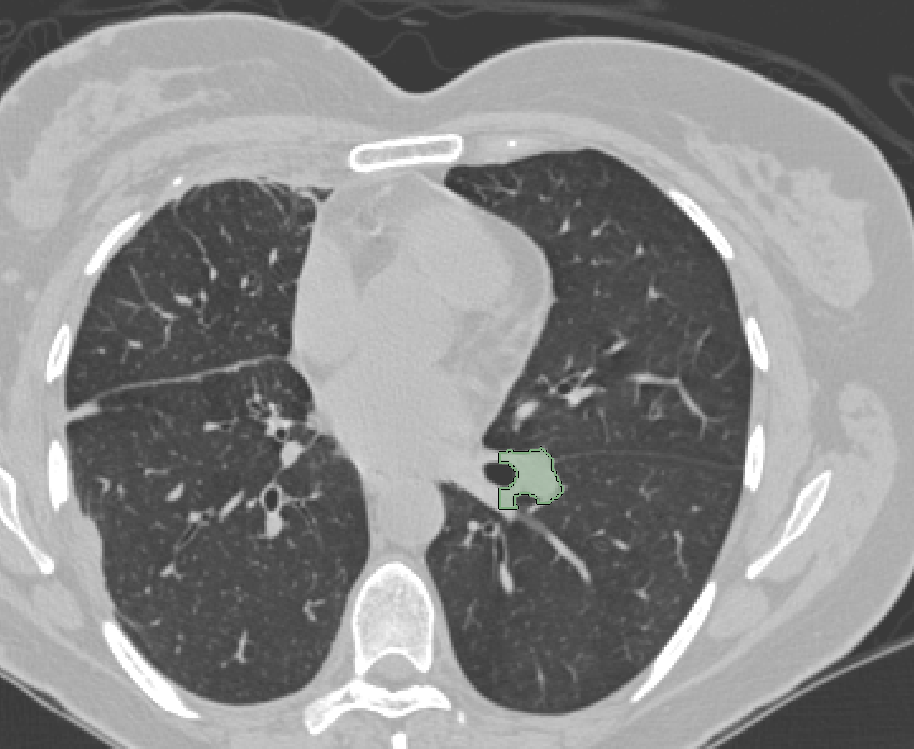

# MITK

1.**Description of the platform/product**:
 * **name and version of the software**: MITK Workbench 2016.11 (not yet released)
 * **free?** yes - http://mitk.org/Downloads
 * **commercial?** no
 * **open source?** yes - https://phabricator.mitk.org/source/mitk.git
 * **what DICOM library do you use?** [DCMTK](http://dcmtk.org), [GDCM](http://gdcm.sourceforge.net/), [DCMQI](http://github.com/qiicr/dcmqi)

2.**Description of the relevant features of the platform**: 
 * **are both single and multiple segments supported?** yes 
 * **how are the overlapping segments handled?** With semi-transparent color overlay and the active label is contoured (see screenshots)

 | 

 * **do you support both BINARY and FRACTIONAL segmentation types?** 
 * **do you render the segment using the color specified in the DICOM object?** yes
 * **how do you communicate segment semantics to the user?** semantic codes are stored as property for each label, so the user can not easily get the information
 * **how do you support the user in defining the semantics of the object at the time segmentation is created?** The user can select from a pre-defined list of organs, structures,... when adding a new label to the segmentation. The selection is mapped to segmentation category/type and color internally

3.**Read task**: load each of the DICOM SEG datasets that accompany the imaging series into your platform

**Test dataset #1**

| Test dataset | Result of rendering |
| -- | -- |
| 3D Slicer |  |
| AIMonClearCanvas|  |
| ePAD |  |
| syngo.via |  |

**Test dataset #2**

| Test dataset | Result of rendering |
| -- | -- |
| 3D Slicer |  |

**Test dataset #3**

| Test dataset | Result of rendering |
| -- | -- |
| 3D Slicer |  |

**Test dataset #4**

TODO:

| Test dataset | Result of rendering |
| -- | -- |
| 3D Slicer |  |

4.**Write task**
 * segment the lung lesion using any method available in your platform; save the result as DICOM SEG; please include in the series description the name of your tool to simplify comparison tasks!
   * results are uploaded
 * run [dciodvfy DICOM validator](http://www.dclunie.com/dicom3tools/dciodvfy.html); iterate on resolving the identified issues as necessary
   * no errors, only warnings from dciodvfy

