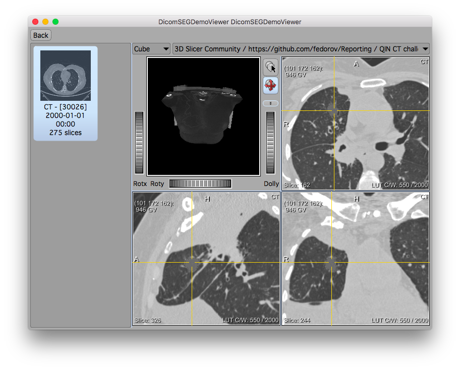
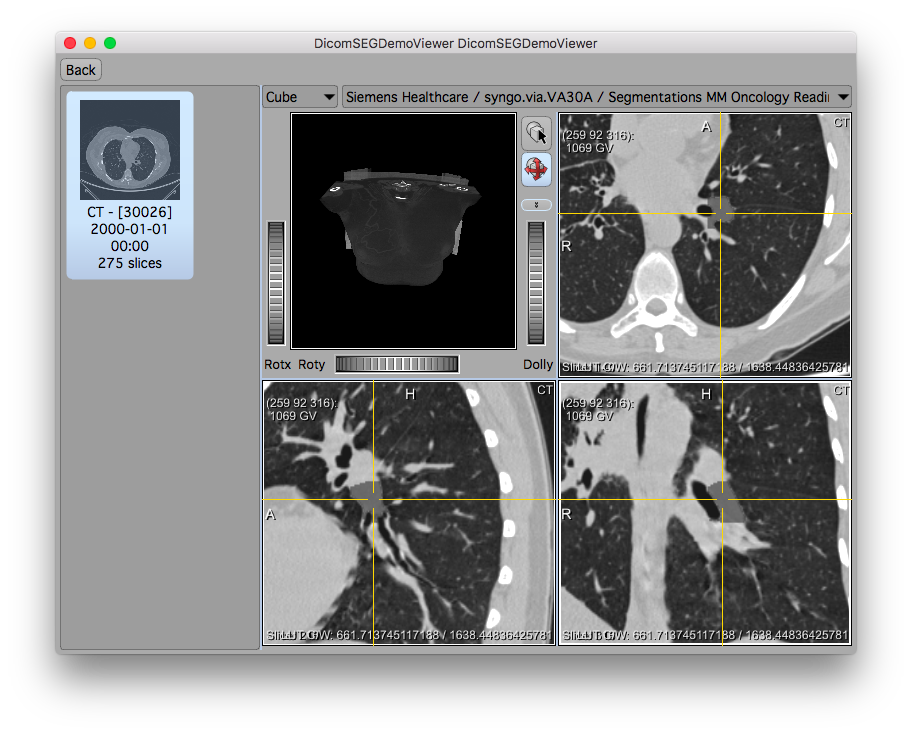
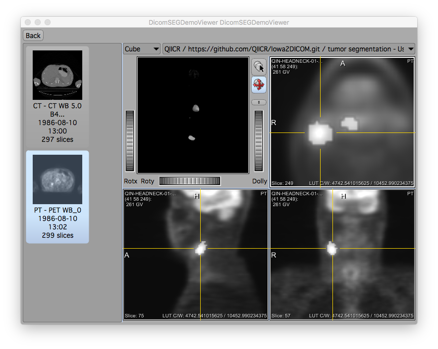
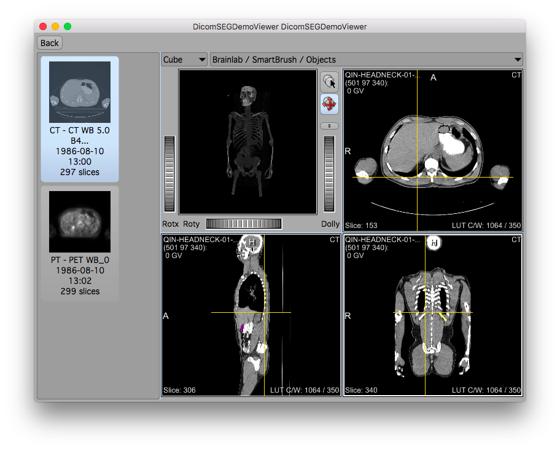
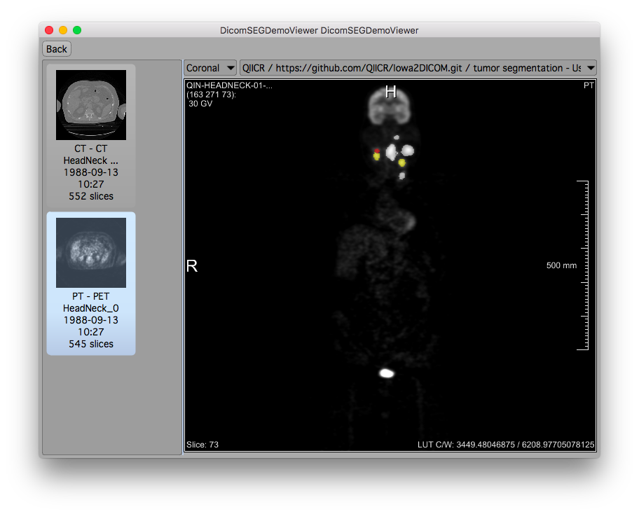
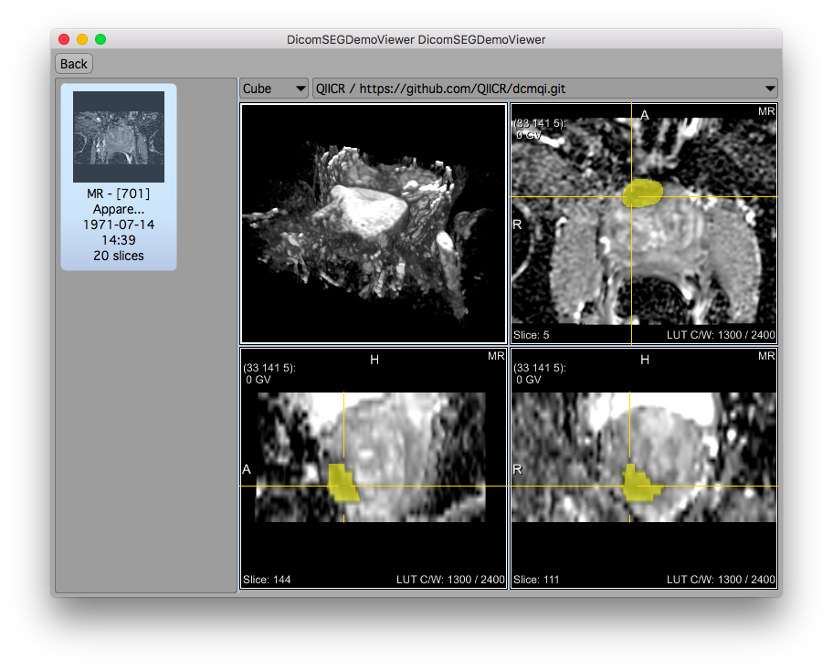

# MeVisLab

1.**Description of the platform/product**:
 * **name and version of the software**: MeVisLab 3.0
 * **free?** yes http://www.mevislab.de/download
 * **commercial?** commercial licenses available on request
 * **open source?** no (only partially, sources included in above download)
 * **what DICOM library do you use?** custom (MLDicomTree, using some headers from dcmtk)

2.**Description of the relevant features of the platform**: 
 * **are both single and multiple segments supported?** yes (reading), single-only (writing)
 * **how are the overlapping segments handled?** loaded separately 
   (display depends on application)
 * **do you support both BINARY and FRACTIONAL segmentation types?**
   yes (reading), only binary supported for writing so far
 * **do you render the segment using the color specified in the DICOM object?** yes / possible (display depends on application)
 * **how do you communicate segment semantics to the user?** MeVisLab
   provides field interface, UI depends on application (no application
   available yet using this new API as of November 2016)
 * **how do you support the user in defining the semantics of the object at the time segmentation is created?** 
   no support is available yet (support similiar to the QIICR web
   interface planned, but not yet implemented)

3.**Read task**: load each of the DICOM SEG datasets that accompany the imaging series into your platform

NB: MeVisLab is an IDE, not an end-user application.  Therefore, both
the rendering of the lesion masks, as well as the display of the meta
information entirely depend on the actual clinical application
prototype. The screenshots below are from a custom MeVisLab network
quickly put together just for this demonstration.

The underlying improved reading capabilities become available to all
clinical applications and prototypes built using recent MeVisLab
versions.  Work on integration into our internal "MeVisLab Application
Framework", e.g. the extension of the object-relational mapping
classes by SEG-relevant structures and the corresponding import code
has begun, but it will take more work to produce nice frontends for
end user-visible applications.

Reading-wise, the new module *MultiFileVolumeListSEGOutput* has been
implemented (and will be shipped as part of the freely available
FMEwork/ReleaseMeVis package together with MeVisLab), which offers not
only the segmentation mask (for which the existing
*MultiFileVolumeListImageOutput* is sufficient), but meta information
about each selected segment.  Again, this information is provided as
MeVisLab fields, extending the internal API by the necessary pieces
for application support; these components are not directly visible to
the end-user.

**Test dataset #1**

| Test dataset | Result of rendering |
| -- | -- |
| 3D Slicer |  |
| ePAD |  |
| syngo.via |  |
| AIMonClearCanvas|  |

**Test dataset #2**

| Test dataset | Result of rendering |
| -- | -- |
| 3D Slicer |  |
| Brainlab |  |

**Test dataset #3**

| Test dataset | Result of rendering |
| -- | -- |
| 3D Slicer |  |

**Test dataset #4**

| Test dataset | Result of rendering |
| -- | -- |
| 3D Slicer |  |

4.**Write task**
 * segment the lung lesion using any method available in your platform; save the result as DICOM SEG; please include in the series description the name of your tool to simplify comparison tasks!
   * results are uploaded
 * run [dciodvfy DICOM validator](http://www.dclunie.com/dicom3tools/dciodvfy.html); 
   iterate on resolving the identified issues as necessary
   * support for SEG writing (in fact, support for writing multi-frame
     DICOM files) has been newly introduced in MeVisLab
   * no remaining issues reported by `dciodvfy` (except for Study attributes inherited from the input data)
 * run [dcentvfy DICOM validator](http://www.dclunie.com/dicom3tools/dcentvfy.html)
   * `PatientIdentityRemoved` and `DeidentificationMethod` tags are not properly copied from input data