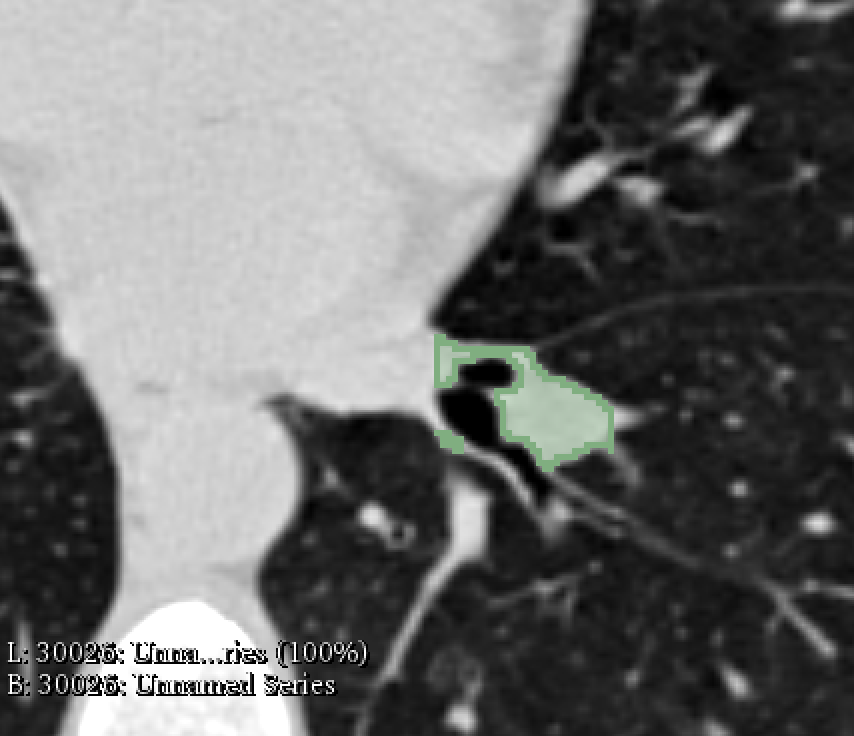
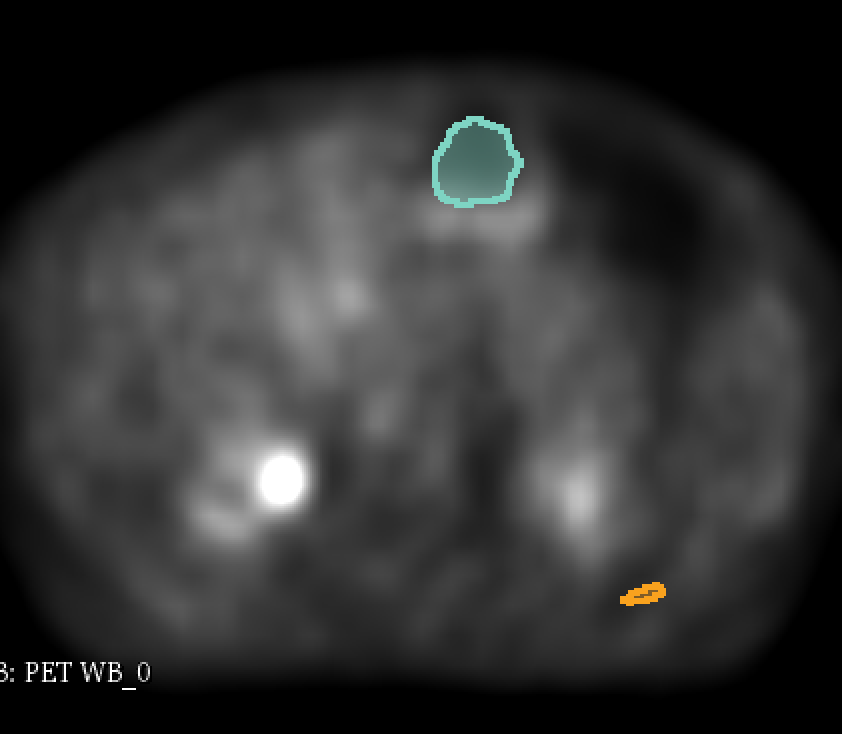

# Brainlab
# 3D Slicer

1.**Description of the platform/product**:
 * **name and version of the software**: Brainlab SmartBrush 2.1 and Brainlab SmartViewer 3.1; SmartViewer can only display DICOM SEG; SmartBrush can create SEG and display them, however SmartViewer displays them much better
 * **free?** no
 * **commercial?** yes
 * **open source?** no 
 * **what DICOM library do you use?** [Merge DICOM Toolkit](http://www.merge.com/Solutions/Toolkits/Merge-DICOM-Toolkit.aspx), however the toolkit does not provide API for handling DICOM SEG objects, so all of the features related to handling DICOM SEG had to be implemented

2.**Description of the relevant features of the platform**: 
 * **are both single and multiple segments supported?** Current version of Brainlab SmartBrush can write only single-segment objects, but reads both single- and multi-segment 
 * **how are the overlapping segments handled?** *TBD*

 * **do you support both BINARY and FRACTIONAL segmentation types?** Brainlab always exports segmentations as FRACTIONAL type and RLE-compressed
 * **do you render the segment using the color specified in the DICOM object?** *TBD*
 * **how do you communicate segment semantics to the user?** *TBD*
 * **how do you support the user in defining the semantics of the object at the time segmentation is created?** *TBD*

3.**Read task**: load each of the DICOM SEG datasets that accompany the imaging series into your platform

**Test dataset #1**

| Test dataset | Result of rendering |
| -- | -- |
| 3D Slicer |  |
| ePAD |  |
| syngo.via |  |
| AIMonClearCanvas|  |

**Test dataset #2**

| Test dataset | Result of rendering |
| -- | -- |
| 3D Slicer |  |
| Brainlab |  |

**Test dataset #3**

| Test dataset | Result of rendering |
| -- | -- |
| 3D Slicer |  |

**Test dataset #4**

| Test dataset | Result of rendering |
| -- | -- |
| 3D Slicer |  |

4.**Write task**
 * segment the lung lesion using any method available in your platform; save the result as DICOM SEG; please include in the series description the name of your tool to simplify comparison tasks!
   * results are uploaded
 * run [dciodvfy DICOM validator](http://www.dclunie.com/dicom3tools/dciodvfy.html); iterate on resolving the identified issues as necessary
   * no errors, only warnings from dciodvfy

