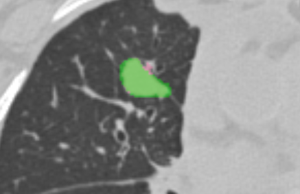
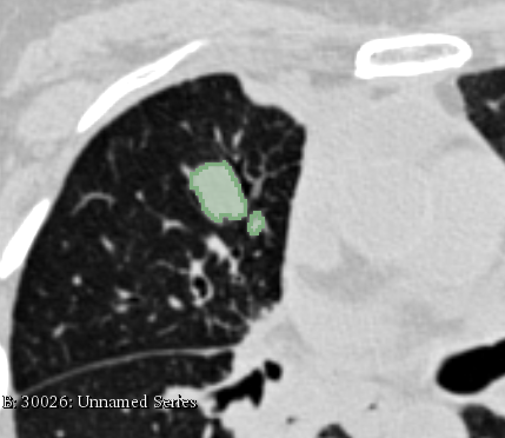

# ePAD

1.**Description of the platform/product**:
 * **name and version of the software**: ePAD, version 2.4
 * **free?** yes https://epad.stanford.edu/epad-agreement
 * **commercial?** no
 * **open source?** yes except plugins and UI project github.com/RubinLab/
 * **what DICOM library do you use?** [PixelMed](http://www.pixelmed.com/), [DCM4CHE](http://www.dcm4che.org/)

2.**Description of the relevant features of the platform**: 
 * **are both single and multiple segments supported?** only single segment is fully supported, we have back-end support for reading multiple segments but the viewer cannot view them yet  
 * **how are the overlapping segments handled?** user can select either to view the outline or as filled (see screenshot below showing both AIMonClearCanvas and Slicer datasets from the Read task)

 | 

 * **do you support both BINARY and FRACTIONAL segmentation types?** yes, segmentations that are saved as FRACTIONAL are mapped to gray scale (see screenshot below showing a FRACTIONAL segmentation)

 * **do you render the segment using the color specified in the DICOM object?** no
 * **how do you communicate segment semantics to the user?** currently user has no means to get information about the semantics of the object as defined in the segmentation
 * **how do you support the user in defining the semantics of the object at the time segmentation is created?** user is presented with a predefined list (same list with Slicer) to identify the semantics of the segmentation. the default values for category and type are both `(T-D0050;SRT;Tissue)`.

3.**Read task**: load each of the DICOM SEG datasets that accompany the imaging series into your platform

**Test dataset #1**

| Test dataset | Result of rendering |
| -- | -- |
| 3D Slicer |  |
| ePAD |  |
| syngo.via |  |
| AIMonClearCanvas|  |
| Brainlab|  |

**Test dataset #2**

At this time, ePAD does not support multi-segment segmentations.

4.**Write task**
 * segment the lung lesion using any method available in your platform; save the result as DICOM SEG; please include in the series description the name of your tool to simplify comparison tasks!
   * results are uploaded
 * run [dciodvfy DICOM validator](http://www.dclunie.com/dicom3tools/dciodvfy.html); iterate on resolving the identified issues as necessary
   * no errors, only warnings from dciodvfy

