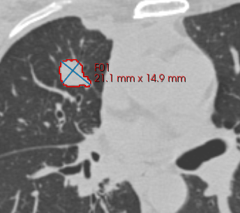
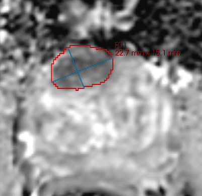

# Mint

1.**Description of the platform/product**:
 * **name and version of the software**: Mint Lesion 3.3 (current development version)
 * **free?** no
 * **commercial?** yes: http://www.mint-medical.com
 * **open source?** no http://github.com/slicer/slicer
 * **what DICOM library do you use?** [DCMTK](http://dcmtk.org), GDCM, DCMQI

2.**Description of the relevant features of the platform**: 
 * **are both single and multiple segments supported?** We are able to read all multiple segment samples. At the moment we can create only single segment dcm due to crashes in the command line tool.
 * **how are the overlapping segments handled?** We store each segment as a separate segment in the application's DB. Therefore statistics are calculated independently.
* **do you support both BINARY and FRACTIONAL segmentation types?**
Unknown
* ** do you support compressed objects? if yes - for reading, writing, or for both? **
Unknown (we store compressed NRRD images in DB)
* **do you render the segment using the color specified in the DICOM object?**
No as we use colors for indicating whether the measurement / segment is selected (red) or not (blue)
* **how do you communicate segment semantics to the user?**
Reporting and a small overview in our "Smart Bar". This overview contains the volume, largest cross diameter in axial image direction, histogram, histogram coefficients (like Skewnews / Kurtosis). On PET images we provide SUV calculations.

3.**Read task**: load each of the DICOM SEG datasets that accompany the imaging series into your platform

**Test dataset #1**

| Test dataset | Result of rendering |
| -- | -- |
| 3D Slicer |  |
| syngo.via |  |
| AIMonClearCanvas|  |

**Test dataset #2**

| Test dataset | Result of rendering |
| -- | -- |
| 3D Slicer |  |

**Test dataset #3**

| Test dataset | Result of rendering |
| -- | -- |
| 3D Slicer |  |

**Test dataset #4**

| Test dataset | Result of rendering |
| -- | -- |
| 3D Slicer |  |
