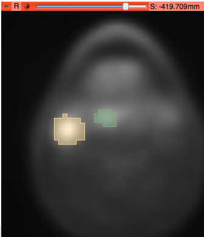
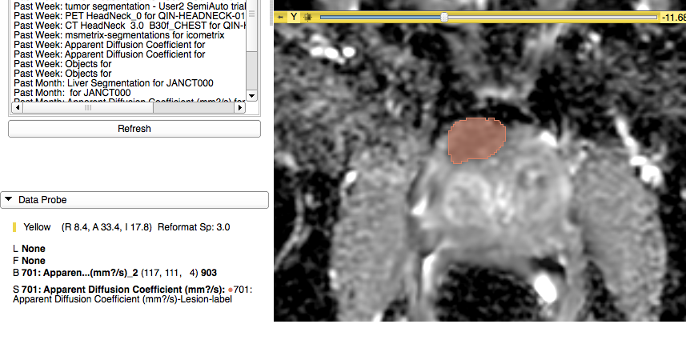

| NOTE: As of November 2018, the new home of DICOM4QI is here: https://dicom4qi.readthedocs.io|
| --- |

# 3D Slicer

1.**Description of the platform/product**:
 * **name and version of the software**: 3D Slicer, Nightly release 4.7.0-2016-11-24, with Reporting extension installed
 * **free?** yes http://download.slicer.org
 * **commercial?** no
 * **open source?** yes http://github.com/slicer/slicer
 * **what DICOM library do you use?** [DCMTK](http://dcmtk.org), [DCMQI](http://github.com/qiicr/dcmqi)

2.**Description of the relevant features of the platform**: 
 * **are both single and multiple segments supported?** yes **how are the overlapping segments handled?** solid color of the outline is shown for all segments; inner area is shown semi-transparent (see screenshot below showing both AIMonClearCanvas and Brainlab datasets from the Read task)

 * **do you support both BINARY and FRACTIONAL segmentation types?** only BINARY can be displayed; SEGs that are saved as FRACTIONAL will be read as BINARY (i.e., no mapping to fractional occupancy or probability will be done)
 * **do you render the segment using the color specified in the DICOM object?** yes
 * **how do you communicate segment semantics to the user?** Display of the segment semantics is provided in specialized Slicer modules. As of November 2016, semantics is shown in a tooltip over the color swatch in the list of segments in Segment Editor module (see screenshot below). Similar interface is provided in the Reporting module.

 * **how do you support the user in defining the semantics of the object at the time segmentation is created?** user can select from the terminology lists by double-clicking on the colored square while editing segment, see screenshot below. Color can also be specified. Certain combinations of codes have suggested colors.

3.**Read task**: load each of the DICOM SEG datasets that accompany the imaging series into your platform

**Test dataset #1**

| Test dataset | Result of rendering |
| -- | -- |
| 3D Slicer |  |
| syngo.via |  |
| AIMonClearCanvas|  |

Note: Brainlab dataset could not be loaded, since it does not have SliceThickness attribute (see CP-1426). This issue has been since fixed in Brainlab, but test datasets 1 and 2 have not been updated.

**Test dataset #2**

| Test dataset | Result of rendering |
| -- | -- |
| 3D Slicer |  |

**Test dataset #3**

| Test dataset | Result of rendering |
| -- | -- |
| 3D Slicer |  |

**Test dataset #4**

| Test dataset | Result of rendering |
| -- | -- |
| 3D Slicer |  |

4.**Write task**
 * segment the lung lesion using any method available in your platform; save the result as DICOM SEG; please include in the series description the name of your tool to simplify comparison tasks!
   * results are uploaded
 * run [dciodvfy DICOM validator](http://www.dclunie.com/dicom3tools/dciodvfy.html); iterate on resolving the identified issues as necessary
   * no errors, only warnings from dciodvfy

