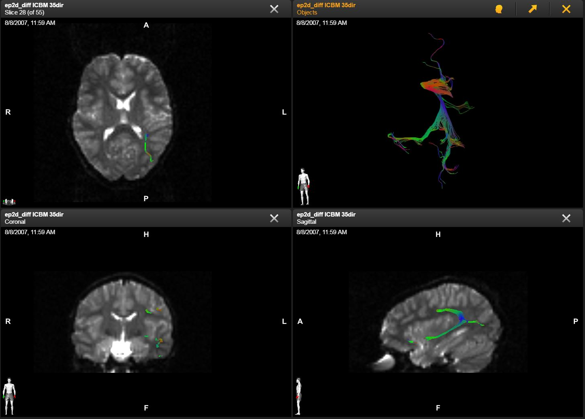
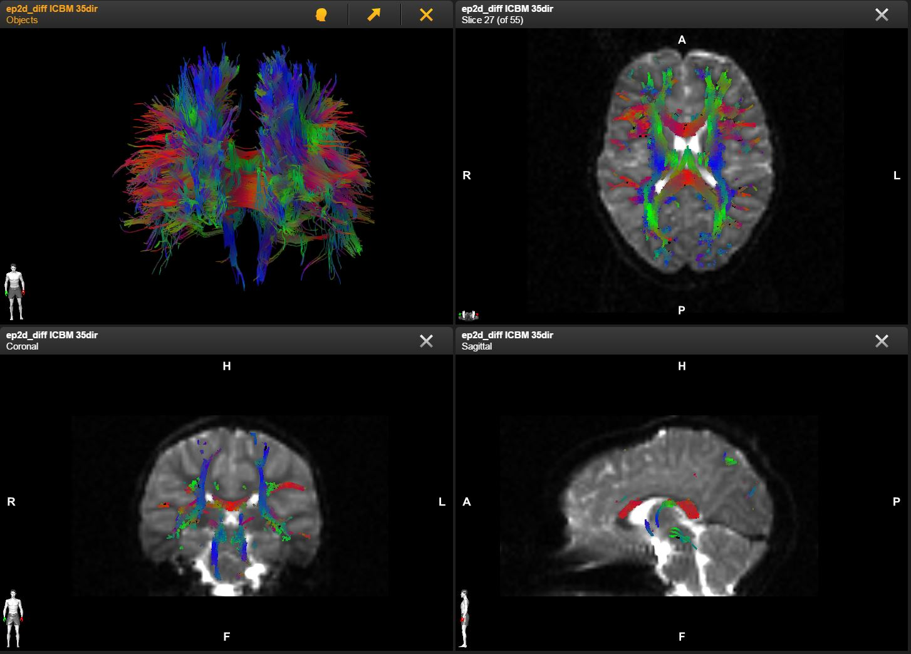
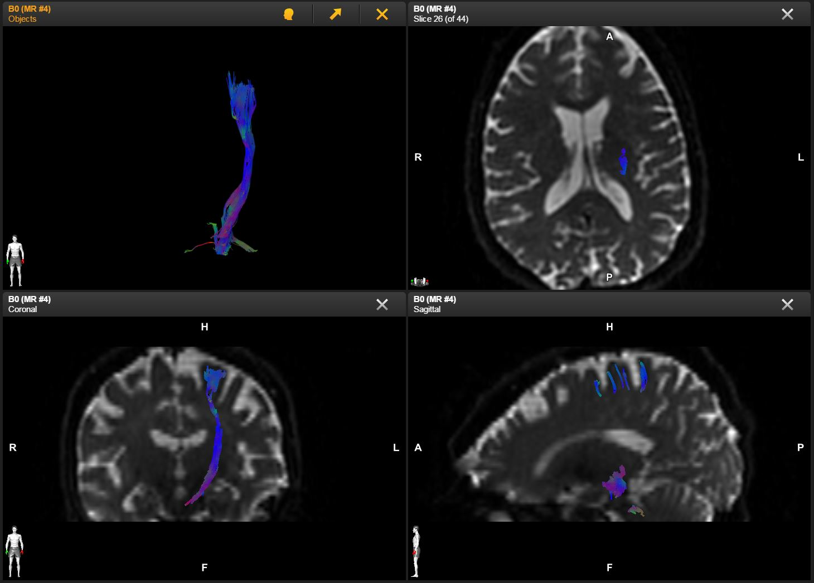

## Brainlab

### 1. Description of the platform/product

   * **name and version of the software** Brainlab FiberTracking 1.1.0
   * **free?** no
   * **commercial?** yes, [https://www.brainlab.com/en/surgery-products/overview-neurosurgery-products/fibertracking-and-functional-planning/](https://www.brainlab.com/en/surgery-products/overview-neurosurgery-products/fibertracking-and-functional-planning/)
   * **open source?** no
   * **what DICOM library do you use?** - Merge DICOM Toolkit

   * **Description of the relevant features of the platform**:

     * **Only Single Track Set** DICOM instances are created by the software.
     * **Measurements stored per Track:**  
       _Fractional Anisotropy_ measurement values are stored for each track point for each track.
         
     *  **Statistics stored per Track:**  
       The _Minimum, Maximum and Mean Fractional Anisotropy_ Value is stored as additional statistical information for each track.  
       The _length_ of each Track is stored as additional statistical information

     *  **Statistics stored per Track Set:**  
       The _Minimum, Maximum and Mean Fractional Anisotropy_ Value is stored as additional statistical information for the whole Track Set.  
       The _Minimum, Maximum and Mean Track length_ is stored as additional statistical information for the whole Track Set.

     * **Diffusion Model, Method of Acquisition, Algorithm identification and Anatomical information** is contained in each DICOM TR instance created by the software.

## 2. Read task -- result of rendering for each dataset

<table> 
<tr>
  <td>Dataset</td>
  <td>BrainLab</td>
  <td>3D Slicer</td>
  <td>MITK</td>
  <td>Prism</td>
</tr>


<!-- dataset_1 -->
<tr>
  <td></td>
  <td><i>TrackSet_DataSet1.dcm</i></td>
  <td><i>3DSlicer_dataset_1[..]-v2.dcm</i></td>
  <td><i>MITK_dataset_1.dcm</i></td>
  <td><i>TrackDataSet1_Prism.dcm</i></td>
</tr>

<tr>
  <td>1</td>
  <td>
      
  </td>
   
  <td>
    
  </td>
   
  <td>
    
  </td>
  
  <td>
    
</td>
  
</tr>


<!-- dataset_2 -->
<tr>
  <td></td>
  <td><i>N/A</i></td>
  <td><i>3DSlicer_dataset_2[..].dcm</i></td>
  <td><i>MITK_dataset_2.dcm</i></td>
  <td><i>TrackDataSet2_Prism.dcm</i></td>
</tr>

<tr>
   <td>2</td>
   <td>
   N/A
   </td>
   
   <td>
     
   </td>
   
   <td>
     
   </td>
   
   <td>
    
   </td>
</tr>

<!-- dataset_3 -->
<tr>
  <td></td>
  <td><i>TrackSet_DataSet3.dcm</i></td>
  <td><i>3DSlicer_dataset_3[..].dcm</i></td>
  <td>N/A</td>
  <td><i>TrackDataSet3_Prism.dcm</i></td>
</tr>

<tr>
  <td>3</td>
  <td>
    
  </td>
  
  <td>
     
  </td>
  
  <td>
    N/A
  </td>
  
  <td>
     
</td>
  
</tr>
</table>


### 3. Write tasks

- [Link to download TR objects](https://www.dropbox.com/sh/gmy2nt1mlfk1k2w/AABlqE8dHd6PUWd5upKZ-Dtua/BrainLab?dl=0)

  #### Notes:
  
- **Multiple Track Sets**:
 
  Brainlab FiberTracking 1.1.0 does not support storage of multiple TrackSets inside one DICOM TR instance.

- **Track Set created based on Test Dataset #1:** 
  - 1 Track Set
  - 503 Tracks
  - Single Colored (turquoise, but shown direction-colored in screenshot)
  - Detailed Track Set Description can be found in    
    - TrackSet Label       (0066,0106)
    - TrackSet Description (0066,0107) (and NOT in Series Description (0008,103e))
  - Additional Measurements
   - Per Track Point
      - Fractional Anisotropy Value for each Track Point for each Track  (stored inside Measurements Sequence (0066,0121)) 
  - Additional Statistics
    - Statistics per Track
      - Four Statistical attributes for each Track (stored inside Track Statistic Sequence (0066,0130))
        - Minimum, Maximum and Mean Fractional Anisotropy values  
        - Path length (i.e. length of a Track, no units, but is millimeter)     
    - Statistics per Track Set
      - Six Statistical attributes for the whole Track Set (stored inside Track Set Statistics Sequence (0066,0124))
        - Minimum, Maximum and Mean Fractional Anisotropy values  
        - Minimum, Maximum and Mean Track lengths (no units, but is millimeter)


- **No Track Set created based on Test Dataset #2:**

   Brainlab FiberTracking Software does not support Track Set creation for Test DataSet 2.

- **Track Set created based on Test Dataset #3:** 
  - 1 Track Set
  - 8 Tracks
  - Single Colored (magenta, but shown direction-colored in screenshot)
  - Detailed Track Set Description can be found in
    - TrackSet Label       (0066,0106)
    - TrackSet Description (0066,0107) (and NOT in Series Description (0008,103e))
  - Additional Measurements
    - Per Track Point
      - Fractional Anisotropy Value for each Track Point for each Track  (stored inside Measurements Sequence (0066,0121))    
  - Additional Statistics
    - Statistics per Track
      - Four Statistical attributes for each Track (stored inside Track Statistic Sequence (0066,0130))
        - Minimum, Maximum and Mean Fractional Anisotropy values  
        - Path length (i.e. length of a Track, no units, but is millimeter)  
    - Statistics per Track Set
      - Six Statistical attributes for the whole Track Set (stored inside Track Set Statistics Sequence (0066,0124))
        - Minimum, Maximum and Mean Fractional Anisotropy values  
        - Minimum, Maximum and Mean Track lengths (no units, but is millimeter)
        
#### Results of validation using `dciodvfy`

* dataset_1
```
(0x0009,0x1030)  ?  - Warning - Unrecognized tag - assuming explicit value representation OK
(0x0009,0x1021)  ?  - Warning - Unrecognized tag - assuming explicit value representation OK
(0x0009,0x1021)  ?  - Warning - Unrecognized tag - assuming explicit value representation OK
(0x0009,0x1024)  ?  - Warning - Unrecognized tag - assuming explicit value representation OK
(0x0067,0x1004)  ?  - Warning - Unrecognized tag - assuming explicit value representation OK
Warning - Missing attribute or value that would be needed to build DICOMDIR - Study Date
Warning - Missing attribute or value that would be needed to build DICOMDIR - Study Time
Warning - Missing attribute or value that would be needed to build DICOMDIR - Study ID
Warning - Value dubious for this VR - (0x0010,0x0010) PN Patient's Name  PN [0] = <619432> - Retired Person Name form
TractographyResults
Error - Missing attribute Type 2C Conditional Element=<Laterality> Module=<GeneralSeries>
Error - Bad Sequence number of Items 38 (1 Required by Module definition) Element=<ReferencedInstanceSequence> Module=<TractographyResults>
Error - Bad attribute Value Multiplicity Type 1C Conditional Element=<ReferencedInstanceSequence> Module=<TractographyResults>
```
* dataset_3
```
(0x0067,0x1004)  ?  - Warning - Unrecognized tag - assuming explicit value representation OK
Warning - Missing attribute or value that would be needed to build DICOMDIR - Study ID
Warning - Value dubious for this VR - (0x0010,0x0010) PN Patient's Name  PN [0] = <anonymous_patient> - Retired Person Name form
TractographyResults
Error - Missing attribute Type 2C Conditional Element=<Laterality> Module=<GeneralSeries>
Error - Bad Sequence number of Items 44 (1 Required by Module definition) Element=<ReferencedInstanceSequence> Module=<TractographyResults>
Error - Bad attribute Value Multiplicity Type 1C Conditional Element=<ReferencedInstanceSequence> Module=<TractographyResults>
```
