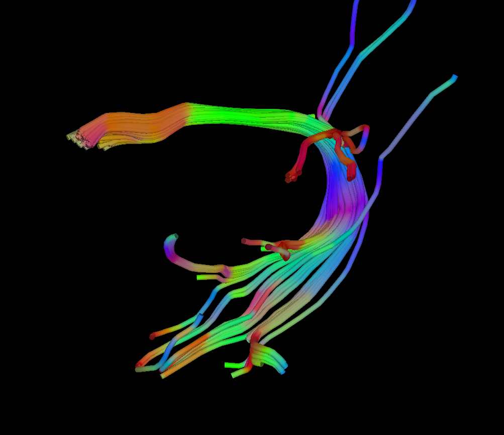
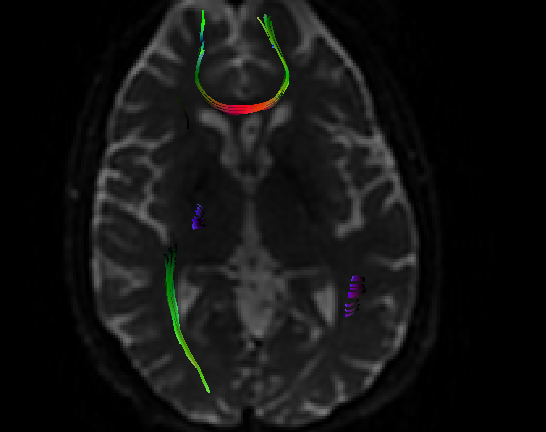
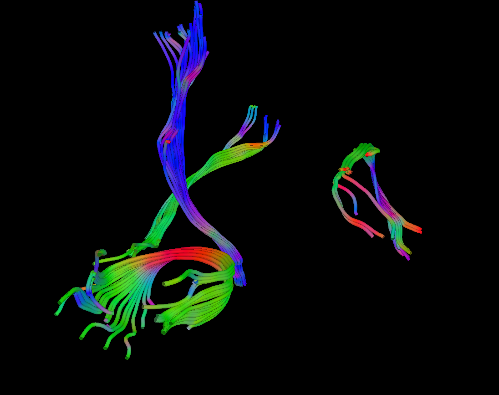

# MITK

### 1. Description of the relevant features of the platform:
  - are multiple tracksets supported in a single file? - **No**
  - do you support any optional measurement data associated with a track? - **No**
  - do you support any optional summary statistics associated with a track set? - **No**
  - do you write any other optional information to the TR file? (e.g. acquisition, model, attribute, algorithm identification etc.)
    - **This information is written but it needs to be set manually using the GUI (see screenshot "TagGui.png"). Manually here means by typing typing it into the correponding form in the application GUI.**
  
  - Other notes:
    - the DICOM tags relevant to associate the tractogram to the original image have to be copied manually from the imported DICOM image. Manually here means that to select the image and the new tractogram and to click a button in the application GUI (see screenshot "TagGui.png").
   -  Dataset 3 was not read correctly --> no tractogram for dataset 3
  
### 2. Read task

<table> 
<tr>
  <td width="33%">MITK</td>
  <td width="33%">BrainLab</td>
  <td width="33%">3D Slicer</td>
</tr>

<!-- dataset_1 -->
<tr>
  <td><i>MITK_dataset_1.dcm</i></td>
  <td><i>TrackSet_DataSet1.dcm</i></td>
  <td><i>3DSlicer_dataset[..]-v2.dcm</i></td>
</tr>

<tr>
  <td>
    (pending screenshot)
  </td>
   
   <td>
    
    
   </td>
   
   <td>
    
    
   </td>
</tr>

<!-- dataset_2 -->
<tr>
  <td><i>MITK_dataset_2.dcm</i></td>
  <td><i>N/A</i></td>
  <td><i>3DSlicer_dataset_2[..].dcm</i></td>
</tr>

<tr>
   <td>
     
     
   </td>
   
   <td><!-- BrainLab n/a --></td>
   
   <td>
     
     

   </td>

</tr>

<!-- dataset_3 -->
<tr>
  <td>N/A</td>
  <td><i>TrackSet_DataSet3.dcm</i></td>
  <td><i>dataset_3_GeSignaHDx.dcm</i></td>
</tr>

<tr>
  <td>
  N/A 
  </td>
   
  <td>
  
  </td>

  <td>
  
  
  </td>
  
</tr>
</table>

### 3. Write task

