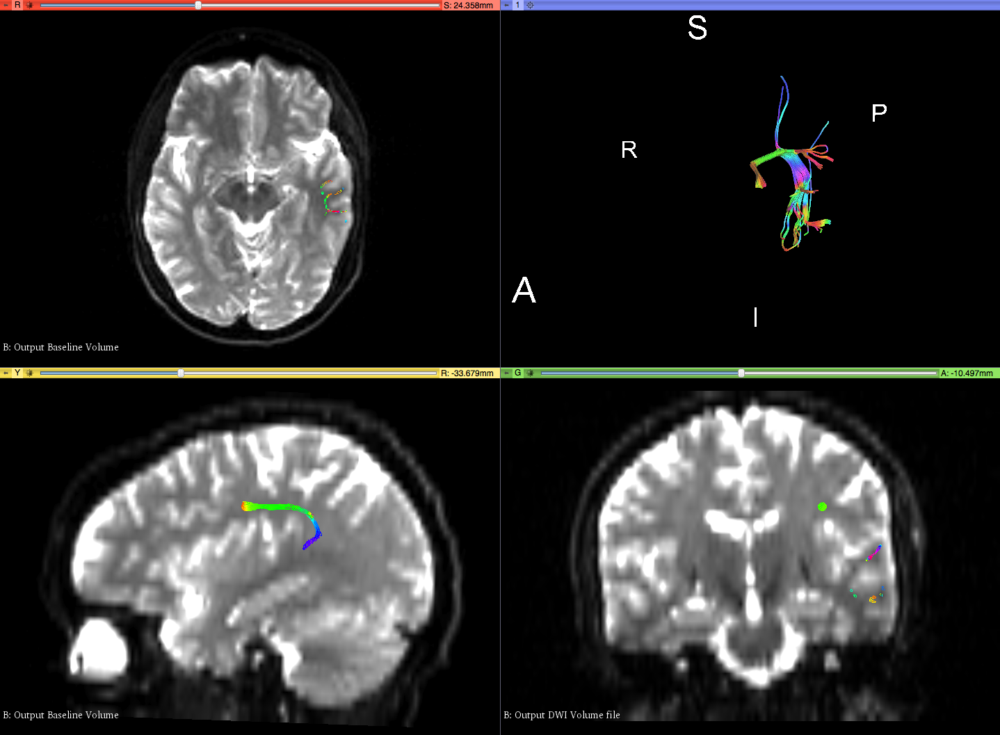
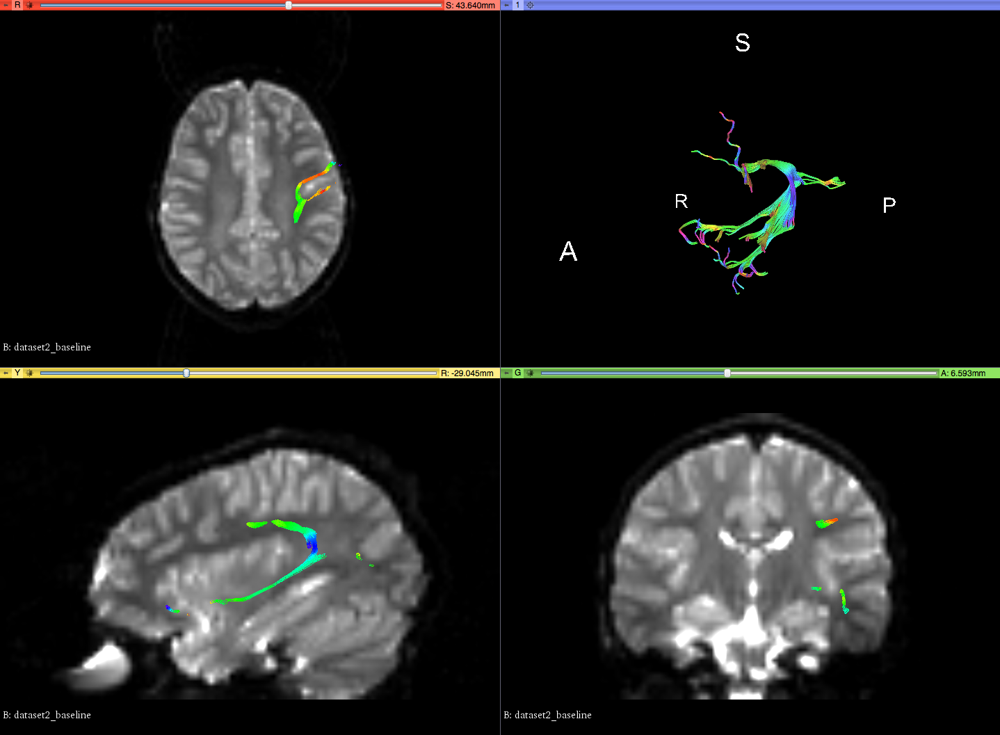
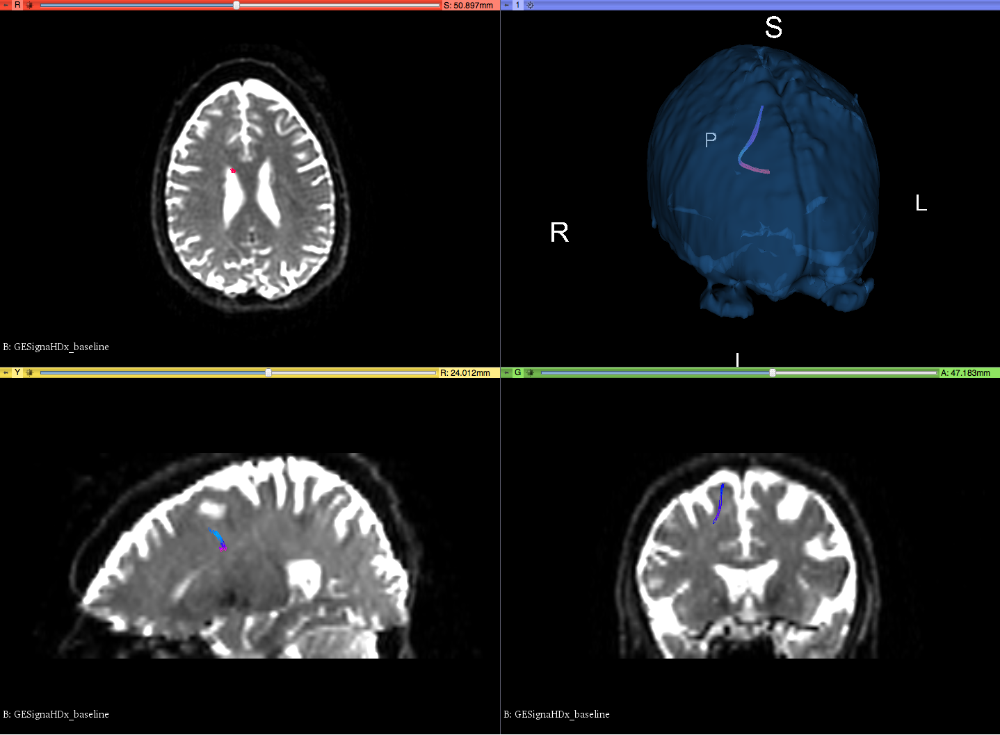
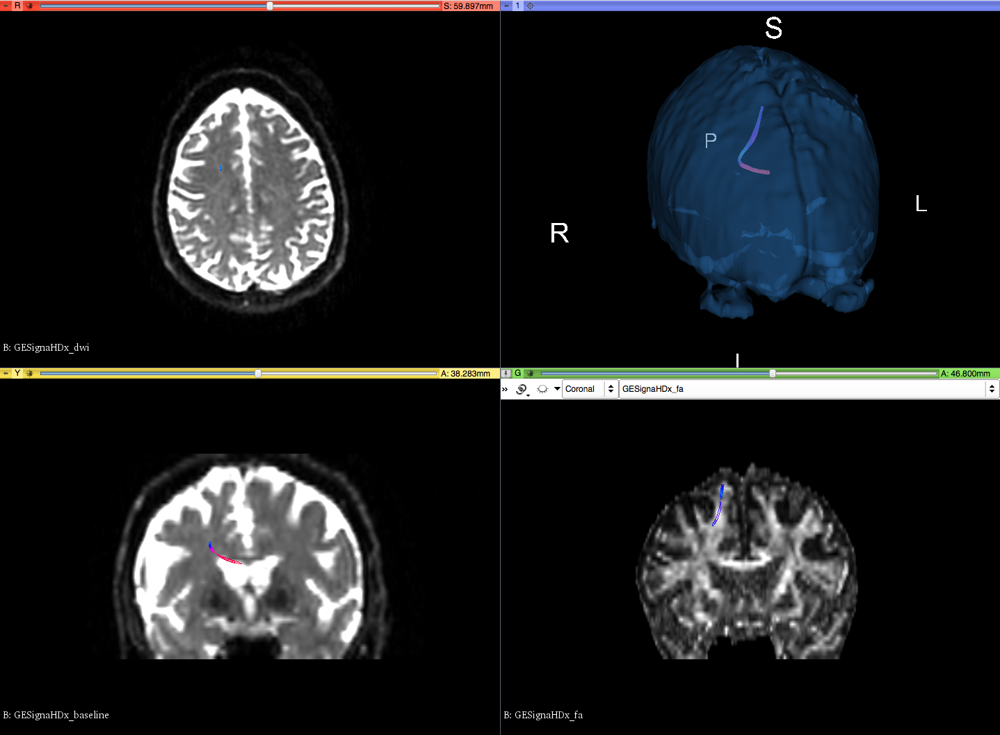

# 3D Slicer

### 1. **Description of the platform/product**:

   - **name and version of the software**: 3D Slicer, nightly release 2017-11-13, with [SlicerDMRI](http://dmri.slicer.org/download/) extension installed.
   - **free?**: Yes, [http://download.slicer.org/](http://download.slicer.org/) and [http://dmri.slicer.org/download/](http://dmri.slicer.org/download/) \(extension instructions\)
   - ~~**commercial?**:~~
   - **open source?**: yes: [https://github.com/SlicerDMRI](https://github.com/SlicerDMRI)
   - **what DICOM library do you use?**: DCMTK
   - **Description of the relevant features of the platform**:
     * are multiple tracksets supported in a single file? - **Not currently**
     * do you support any optional measurement data associated with a track? - **No**
     * do you support any optional summary statistics associated with a track set? - **No**
     * do you write any other optional information to the TR file? \(e.g. acquisition, model, attribute, algorithm identification etc.\) - **No**

### 2. **Read task** Screenshots of trackset results for each platform, loaded with 3D Slicer:

<table> 
<tr>
  <td>3D Slicer</td>
  <td>BrainLab</td>
  <td>MITK</td>
</tr>

<!-- dataset_1 -->
<tr>
  <td><i>3DSlicer_dataset_1_SiemensVerio_dwi6dirmosaicoff-v2.dcm</i></td>
  <td><i>TrackSet_DataSet1.dcm</i></td>
  <td><i>MITK_dataset_1.dcm</i></td>
</tr>

<tr>
  <td>
    
   </td>
   
   <td>
   
   
   </td>
   
   <td>
   
   </td>
</tr>

<!-- dataset_2 -->
<tr>
  <td><i>3DSlicer_dataset_2_SiemensTrio.dcm</i></td>
  <td><i>N/A</i></td>
  <td><i>MITK_dataset_2.dcm</i></td>
</tr>

<tr>
   <td>
   
   </td>
   
   <td><!-- BrainLab n/a --></td>
   
   <td>
   
   </td>

</tr>

<!-- dataset_3 -->
<tr>
  <td><i>dataset_3_GeSignaHDx.dcm</i></td>
  <td><i>TrackSet_DataSet3.dcm</i></td>
  <td>N/A</td>
</tr>

<tr>
  <td>
   
  </td>
   
  <td>
  
  
  </td>
  <td>
  <!-- MITK n/a -->
  </td>
  
</tr>
</table>

### 3. **Write tasks**

   * Datasets are available in the "3DSlicer_TR" folder of the [Results Dropbox folder](https://www.dropbox.com/sh/gmy2nt1mlfk1k2w/AADIdfcLUUZ8ViAh7i6x0aana?dl=0).

