# 3D Slicer

## 1. **Description of the platform/product**:

* **name and version of the software**: 3D Slicer, nightly release 2017-11-13, with [SlicerDMRI](http://dmri.slicer.org/download/) extension installed.
* **free?**: Yes, [http://download.slicer.org/](http://download.slicer.org/) and [http://dmri.slicer.org/download/](http://dmri.slicer.org/download/) \(extension instructions\)
* **commercial?**: no
* **open source?**: yes: [https://github.com/SlicerDMRI](https://github.com/SlicerDMRI)
* **what DICOM library do you use?**: DCMTK
* **Description of the relevant features of the platform**:
  * are multiple tracksets supported in a single file? - **Not currently**
  * do you support any optional measurement data associated with a track? - **No**
  * do you support any optional summary statistics associated with a track set? - **No**
  * do you write any other optional information to the TR file? \(e.g. acquisition, model, attribute, algorithm identification etc.\) - **No**

## 2. **Read task** Screenshots of trackset results for each platform, loaded with 3D Slicer:

|  |
| :--- |

| **Dataset** | 3D Slicer | Brainlab | MITK | Prism |
| :--- | :--- | :--- | :--- | :--- |

|  |
| :--- |

  
  

| 1 |
| :--- |

|   |
| :--- |

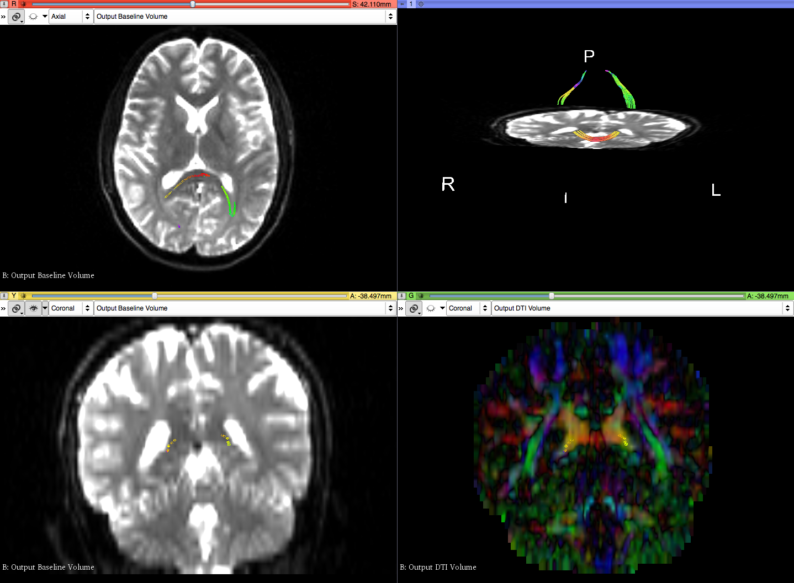

|  |
| :--- |

|   |
| :--- |

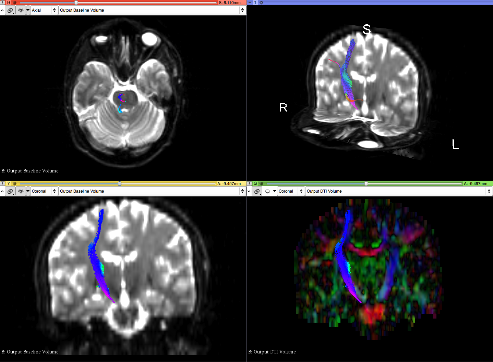

|   |
| :--- |

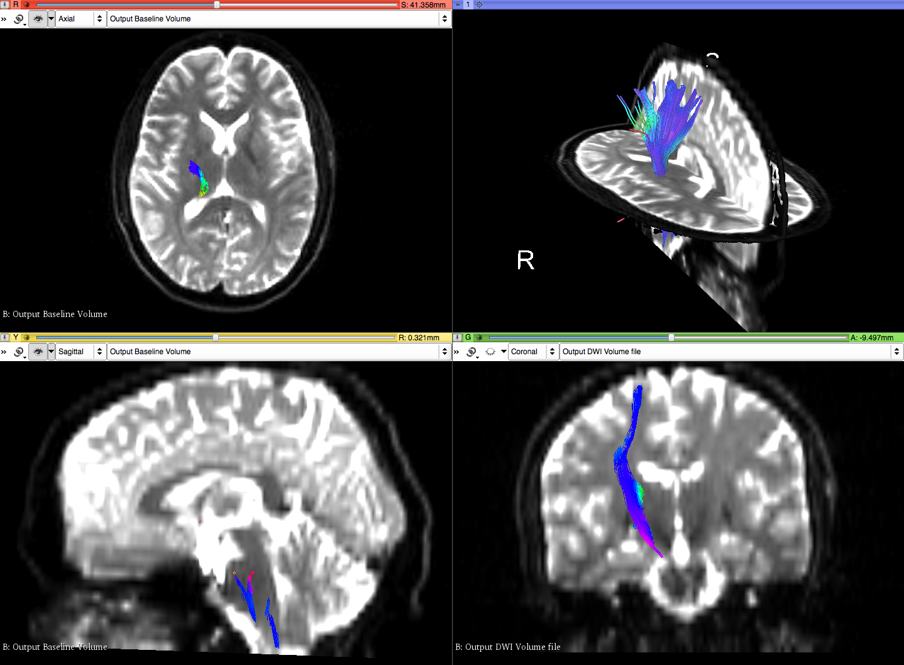

|  |
| :--- |

|   |
| :--- |

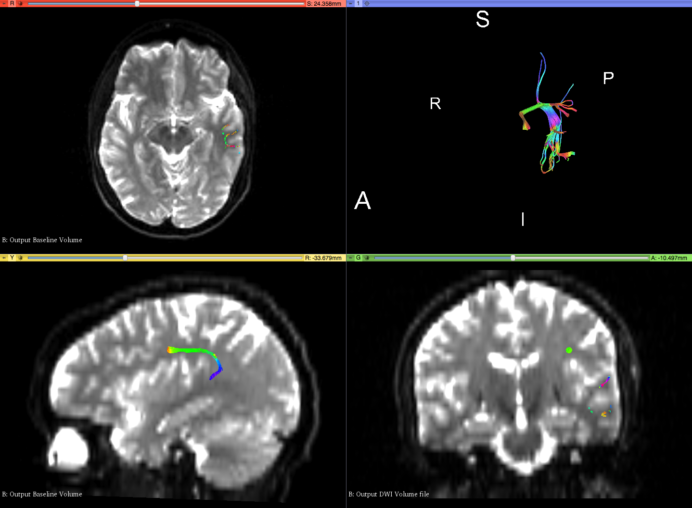

|  |
| :--- |

|   |
| :--- |

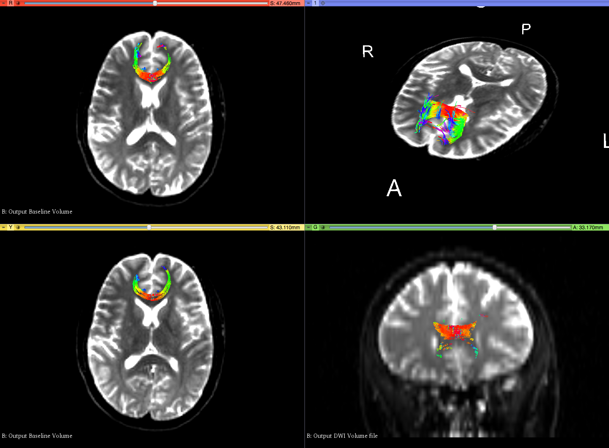

|  |
| :--- |

  
&lt;/tr&gt;

|  |
| :--- |

  
   

| 2 |
| :--- |

|   |
| :--- |

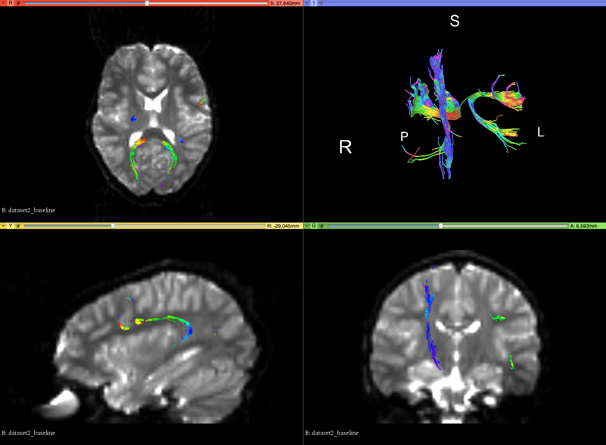

|  |
| :--- |

| N/A |
| :--- |

|   |
| :--- |

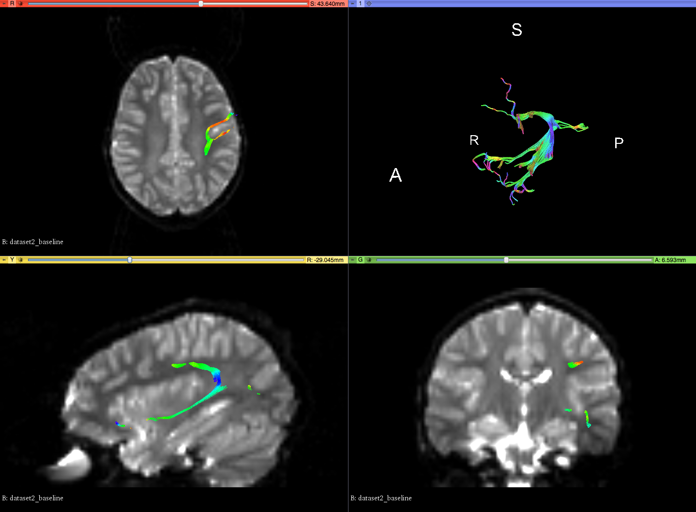

|  |
| :--- |

|   |
| :--- |

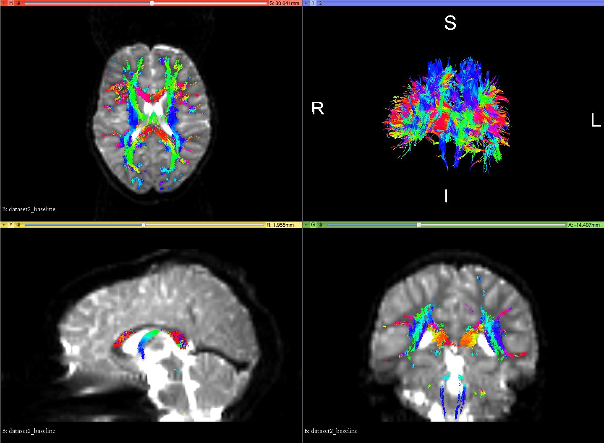

|  |
| :--- |

  
&lt;/tr&gt;

|  |
| :--- |

  
  

| 3 |
| :--- |

|   |
| :--- |

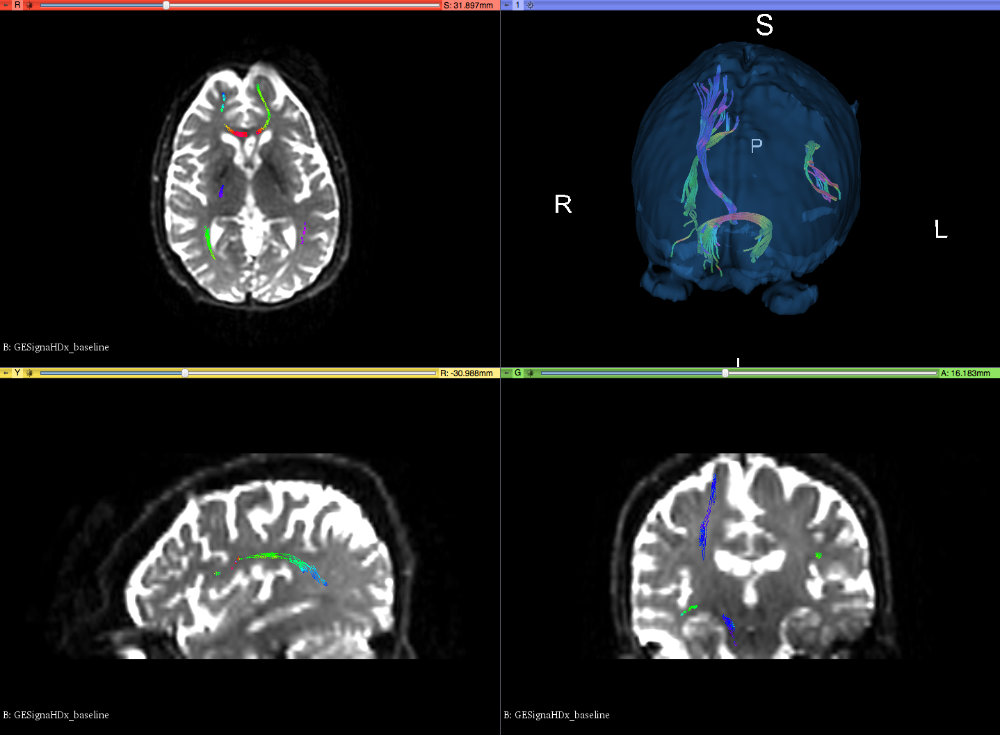

|  |
| :--- |

|   |
| :--- |

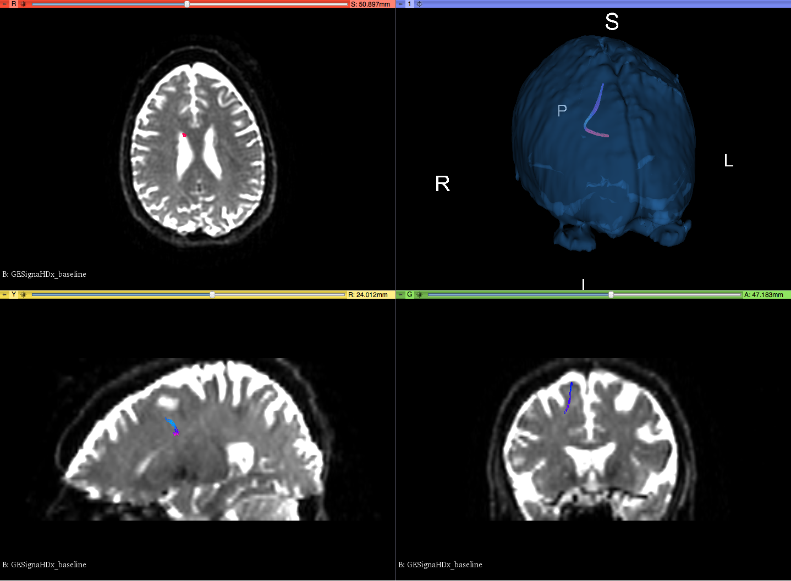

|   |
| :--- |

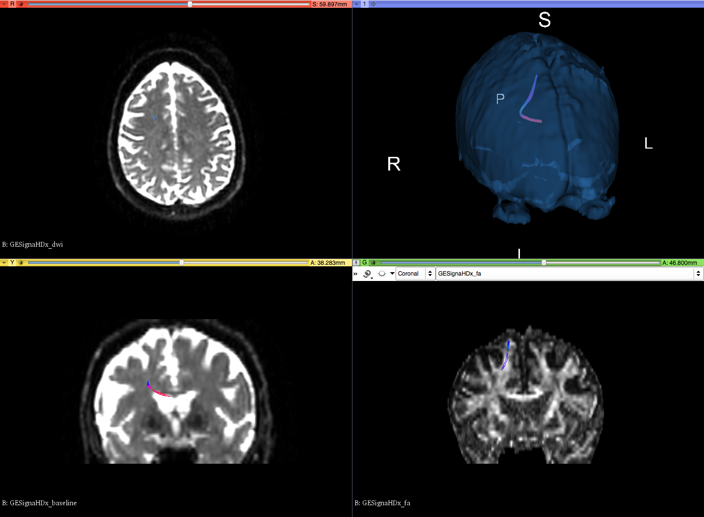

|  |
| :--- |

| N/A |
| :--- |

|   |
| :--- |

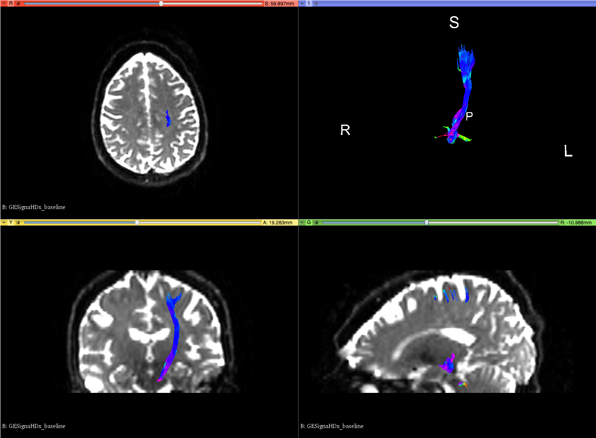

|  |
| :--- |

  
&lt;/tr&gt;  
&lt;/table&gt;

## 3. **Write tasks**

* Datasets are available in the "3DSlicer\_TR" folder of the [Results Dropbox folder](https://www.dropbox.com/sh/gmy2nt1mlfk1k2w/AADIdfcLUUZ8ViAh7i6x0aana?dl=0).

### Results of validation using `dciodvfy`

Pending

