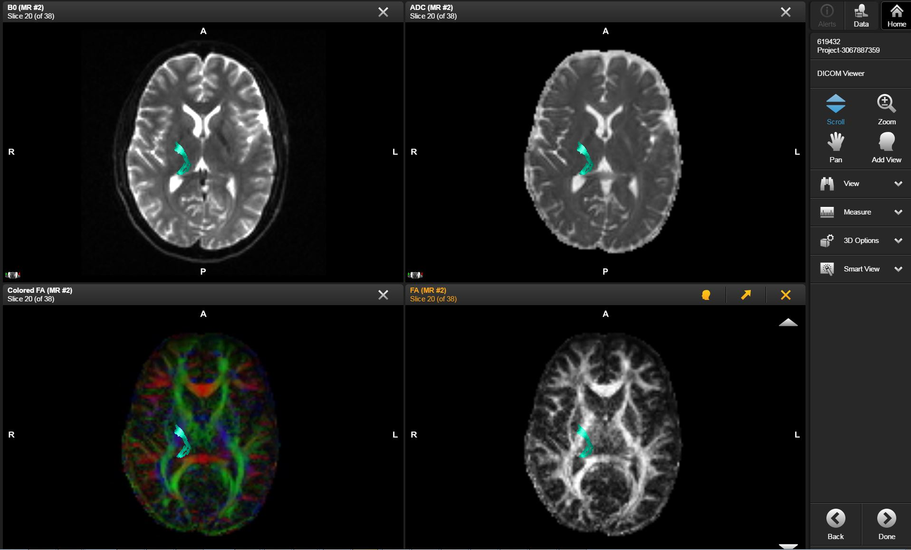
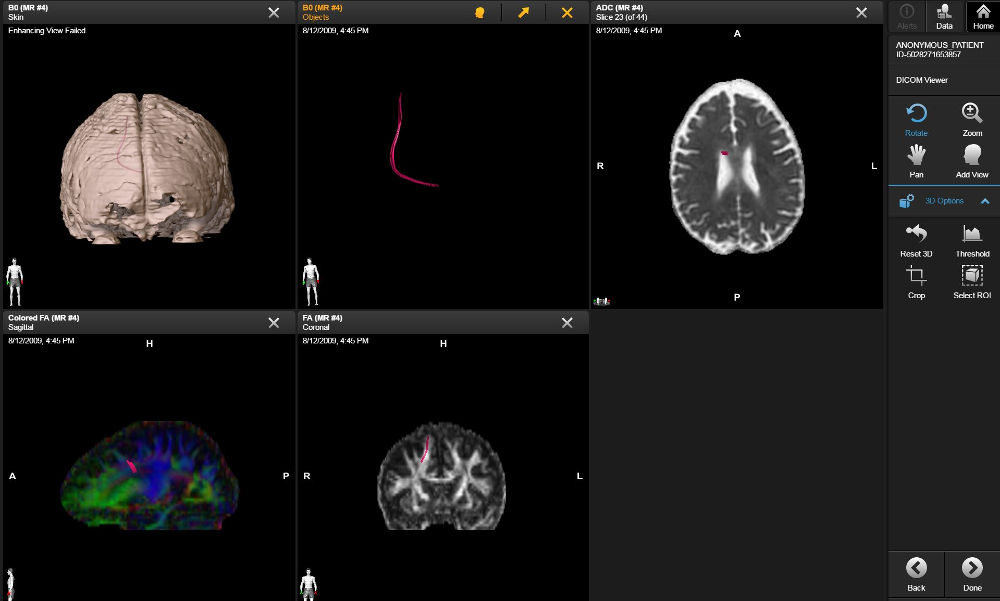
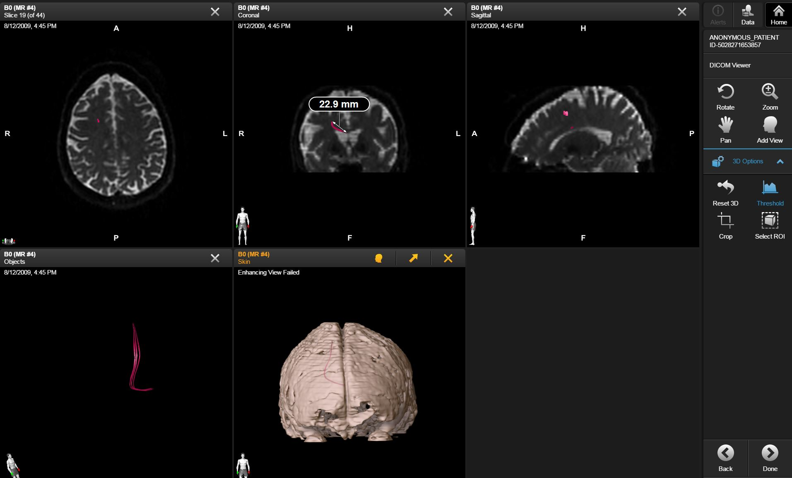

## Brainlab

**1. Description of the platform/product**:

   * **name and version of the software** Brainlab FiberTracking 1.1.0
   * ~~**free?**~~
   * **commercial?** [https://www.brainlab.com/en/surgery-products/overview-neurosurgery-products/fibertracking-and-functional-planning/](https://www.brainlab.com/en/surgery-products/overview-neurosurgery-products/fibertracking-and-functional-planning/)
   * ~~**open source?**~~ 
   * **what DICOM library do you use?** - Merge DICOM Toolkit

   * **Description of the relevant features of the platform**:

     * Only _Single Track Set_ DICOM instances are created by the software.
     * **Measurements** stored per Track:  
       _Fractional Anisotropy_ measurement values are stored for each track point for each track.  
       **Statistics** stored per Track:  
       The _Minimum, Maximum and Mean Fractional Anisotropy_ Value is stored as additional statistical information for each track.  
       The _length_ of each Track is stored as additional statistical information

     * **Statistics** stored per Track Set:  
       The _Minimum, Maximum and Mean Fractional Anisotropy_ Value is stored as additional statistical information for the whole Track Set.  
       The _Minimum, Maximum and Mean Track length_ is stored as additional statistical information for the whole Track Set.

     * _Diffusion Model, Method of Acquisition, Algorithm identification and Anatomical information_ is contained in each DICOM TR instance created by the software.

**2. Read task** \(for each dataset!\)

   * load each of the DICOM TR datasets that accompany the imaging series into your platform
   
   
   **Test dataset #1 - Result of rendering**
   
   **3D Slicer**

Picture above shows the TR object generated by 3D Slicer created for Data Set 1 in Brainlab FiberTracking software. One can see the Track Set in direction-coloring in a 3D view.

Picture above shows the TR object generated by 3D Slicer created for Data Set 1 in Brainlab ImageViewer software. One can see the Track Set in (non-directed) single-coloring in three 2D views (showing the TR object on the B0, FA and colored FA data sets) and one 3D view from a different perspective as in the other screenshot.. 

**3. Write tasks**

* **Single trackset**: select a tractography streamline bundle using any method available in your platform.
   
**Track Set created based on Test dataset #1**

Contains:
- 1 Track Set
- 503 Tracks
- Single Colored (green)

Detailed Track Set Description can be found in
- TrackSet Label       (0066,0106)
- TrackSet Description (0066,0107)
(and NOT in Series Description (0008,103e))

==== Additional Measurements =====

---- Per Track Point -------------

- Fractional Anisotropy Value for each Track Point for each Track  (stored inside Measurements Sequence (0066,0121)) 

==== Additional Statistics =======

----- Statistics per Track -------

Four Statistical attributes for each Track (stored inside Track Statistic Sequence (0066,0130))
- Minimum, Maximum and Mean Fractional Anisotropy values  
- Path length (no units, but is millimeter)

----- Statistics per Track Set -------

Six Statistical attributes for the whole Track Set (stored inside Track Set Statistics Sequence (0066,0124))
- Minimum, Maximum and Mean Fractional Anisotropy values  
- Minimum, Maximum and Mean Track lengths (no units, but is millimeter)

=========================================================================

**No Track Set created based on Test dataset #2**

Brainlab FiberTracking Software does not support Track Set creation for Test DataSet 2.
The reason for that is that the software expects the direction vectors to be stored in the DICOM Header which is not the case for this data set.

=========================================================================

**Track Set created based on Test dataset #3**

Contains:
- 1 Track Set
- 8 Tracks
- Single Colored (magenta)

Detailed Track Set Description can be found in
- TrackSet Label       (0066,0106)
- TrackSet Description (0066,0107)
(and NOT in Series Description (0008,103e))

==== Additional Measurements =====

---- Per Track Point -------------

- Fractional Anisotropy Value for each Track Point for each Track  (stored inside Measurements Sequence (0066,0121)) 

==== Additional Statistics =======

----- Statistics per Track -------

Four Statistical attributes for each Track (stored inside Track Statistic Sequence (0066,0130))
- Minimum, Maximum and Mean Fractional Anisotropy values  
- Path length (no units, but is millimeter)

----- Statistics per Track Set -------

Six Statistical attributes for the whole Track Set (stored inside Track Set Statistics Sequence (0066,0124))
- Minimum, Maximum and Mean Fractional Anisotropy values  
- Minimum, Maximum and Mean Track lengths (no units, but is millimeter)

=========================================================================

* **Multiple tracksets**: Brainlab FiberTracking 1.1.0 does not support storage of multiple TrackSets inside one DICOM TR instance.
   
* [UPLOAD THE RESULTING DICOM TR FILES HERE](https://www.dropbox.com/request/XvwJrx22BxMxx6EcIZr3). \(note: after upload, data will be publicly accessible from link in results section\)

